# ***NLP to analyze Judicial Documents***
*Kushagra Bhatnagar and Sudipta Kumar Hazra*

*Abstract:* 
This project try to explore different concepts of Machine Learning and Natural Languge Processing. 

Below are topics which were explored,

a. Regular Expression;
b. Exploratory Data Analysis; 
c. Building Classifiers using Bernoulli Naive Bayes, kNN, Logistic Regression, Decision Tree, Neural Networks; 

d. Feature Inference and Selection; 

e. Use of Oversampling and Under Sampling 

<br>

# Table of Contents
1. [Importing Libraries](#A.-**Importing-Libraries**)
2. [PDF Data Extraction and Pre-processing with Regular Expression](# B. **Extraction of Features (IPCs and Arm Acts)**)
3. [Saving Clean Data](#C. **Importing the Cleaned Data from .csv files**)
4. [Exploratory Data Analysis (EDA)](# D. **Exploratory Data Analysis**)
5. [Classification of Unbalamnced Data](# E. **Classifiers for Unbalanced Data**)
6. [Classification of Balanced Data (Resampled Data)]()


# A. **Importing Libraries**

### a. Importing Libraries for Modeling


```python
# from tika import parser
import matplotlib.pyplot as plt
import numpy as np
import pandas as pd
import sklearn
import pandas as pd
```

### b. Syncing the Drive to Import Data


```python
from google.colab import drive
drive.mount('/content/drive')
```

    Mounted at /content/drive


### c. Importing Libraries for Features


```python
import nltk
from nltk.corpus import stopwords
#stopwords.words("english")
import re
porter = nltk.PorterStemmer()
WNLemma = nltk.WordNetLemmatizer()
stop_words = set(stopwords.words("english"))
```

# B. **Extraction of Features (IPCs and Arm Acts)**

### a. From No Bail Files


```python
#ls = ("u/s" , "u\s" , "us." , "u.s")
#for i in ls:
#    print("[1]" , f.split("ipc")[0].split(i)[-1])
file_text_nobail = pd.DataFrame({

    "IPC" : [] ,
    "ARMS ACT" : [],
    "CATEGORY" : []

}
)

fileloc = "C:/Users/kusha/Desktop/Case File/No Bail/"
c = 0    #for no bail
for i in range(1,171) :   #changed
    fileloc = "C:/Users/kusha/Desktop/Case File/No Bail/"
    filename = i
    file = fileloc + str(filename) + ".pdf"
    raw = parser.from_file(file)
    text = (raw['content'])
    t1 = text.replace(u'\xad',"").lower().split()

    f = " ".join(t1)
    #"indian penal code" in f
    k = f.replace("indian penal code" , "ipc")
    k = k.replace("i.p.c" , "ipc")
    k = k.replace(" r/w. section" , "rws")
    k = k.replace(" r/w section", "rws")
    k = k.replace(" r\w. section" , "rws")
    k = k.replace(" r\w section", "rws")
    k = k.replace(" r/w" , "rws")
    k = k.replace(" r\w" , "rws")
    k = k.replace("read with section" , "rws")


    ls = ["u/s" , "u\s" , "us." , "u.s","section","under sec","sec"] #,"and"
    k1 = k
### LOOP FOR CHANGING TO UNDSEC
    for i in ls :
        if "arms act" in k:
            k1 = k1.split("arms act")[0].replace(i , "undsec")
        else:
            k1 = k1.split("ipc")[0].replace(i , "undsec")

### KEEPING IPC IN DATASET
#    rms = re.sub(r"[^a-zA-Z0-9 ]", "", k1.split("undsec")[-1])
#    ipc_list = re.findall(r'\d{1,3}?[a-z]{1,2}|\d{1,3}', rms)
### KEEPING ARMS ACT
    if "arms act" in k:
        #aa_text = re.sub(r"[^a-zA-Z0-9 ]", "", k1.split("undsec")[-1])
        aa_text = re.sub(r"[^a-zA-Z0-9 ]", "", k1.split("ipc")[-1].split("undsec")[-1])
        aa_list = re.findall(r'\d{1,3}?[a-z]{1,2}|\d{1,3}', aa_text)
        ipc_text = re.sub(r"[^a-zA-Z0-9 ]", "", k1.split("ipc")[0].split("undsec")[-1])
        ipc_list = re.findall(r'\d{1,3}', ipc_text)#?[a-z]{1,2}|\d{1,3}
    else:
        ipc_text = re.sub(r"[^a-zA-Z0-9 ]", "", k1.split("undsec")[-1])
        ipc_list = re.findall(r'\d{1,3}', ipc_text)#?[a-z]{1,2}|\d{1,3}
        aa_list = "NA"


    temp_dict = {"IPC": ",".join(ipc_list),"ARMS ACT" : ",".join(aa_list), "CATEGORY" : c}
    file_text_nobail = file_text_nobail.append(temp_dict, ignore_index=True, sort=False)
```

    2022-06-15 16:51:34,055 [MainThread  ] [WARNI]  Failed to see startup log message; retrying...


```python
file_text_nobail.IPC[10]
```


    '420,406,465,468,471,34'


### b. From Bail Files


```python
file_text_bail = pd.DataFrame({

    "IPC" : [] ,
    "ARMS ACT" : [],
    "CATEGORY" : []

}
)


c = 1    #for bail
for i in range(1,345) :
    fileloc = "C:/Users/kusha/Desktop/Case File/Bail/"
    filename = i
    file = fileloc + str(filename) + ".pdf"
    raw = parser.from_file(file)
    text = (raw['content'])
    t1 = text.replace(u'\xad',"").lower().split()

    f = " ".join(t1)
    f = f.split("following order")[0]
    #"indian penal code" in f
    k = f.replace("indian penal code" , "ipc")
    k = k.replace("i.p.c" , "ipc")
    k = k.replace(" r/w. section" , "rws")
    k = k.replace(" r/w section", "rws")
    k = k.replace(" r\w. section" , "rws")
    k = k.replace(" r\w section", "rws")
    k = k.replace(" r/w" , "rws")
    k = k.replace(" r\w" , "rws")
    k = k.replace("read with section" , "rws")


    ls = ["u/s" , "u\s" , "us." , "u.s","section","under sec","sec","under se"]
    k1 = k
### LOOP FOR CHANGING TO UNDSEC
    for i in ls :
        if "arms act" in k:
            k1 = k1.split("arms act")[0].replace(i , "undsec")
        else:
            k1 = k1.split("ipc")[0].replace(i , "undsec")

### KEEPING IPC IN DATASET
#    rms = re.sub(r"[^a-zA-Z0-9 ]", "", k1.split("undsec")[-1])
#    ipc_list = re.findall(r'\d{1,3}?[a-z]{1,2}|\d{1,3}', rms)
### KEEPING ARMS ACT
    if "arms act" in k:
        #aa_text = re.sub(r"[^a-zA-Z0-9 ]", "", k1.split("undsec")[-1])
        #aa_text = re.sub(r"[^a-zA-Z0-9 ]", "", k1.split("ipc")[-1])
        aa_text = re.sub(r"[^a-zA-Z0-9 ]", "", k1.split("ipc")[-1].split("undsec")[-1])
        aa_list = re.findall(r'\d{1,3}?[a-z]{1,2}|\d{1,3}', aa_text)
        ipc_text = re.sub(r"[^a-zA-Z0-9 ]", "", k1.split("ipc")[0].split("undsec")[-1])
        ipc_list = re.findall(r'\d{1,3}', ipc_text)#?[a-z]{1,2}|\d{1,3}
    else:
        if "ipc" in k:
            ipc_text = re.sub(r"[^a-zA-Z0-9 ]", "", k1.split("undsec")[-1])
            ipc_list = re.findall(r'\d{1,3}', ipc_text)#?[a-z]{1,2}|\d{1,3}
            aa_list = ["NA"]
        else:
            aa_list = ["NA"]
            ipc_list = ["NA"]


    temp_dict = {"IPC": ",".join(ipc_list),"ARMS ACT" : ",".join(aa_list), "CATEGORY" : c}
    file_text_bail = file_text_bail.append(temp_dict, ignore_index=True, sort=False)
```


```python
file_text_bail.IPC[242]
```


    '177,181,182,191,192,193,196,197,198,199,200,203,209,211,415,417,463,464,465,468,469,471,476,120,34'


### c. Extracting set of all unique IPC


```python
uni_ipc = (",".join(file_text_bail.IPC[0:343])+","+(",".join(file_text_nobail.IPC[0:169]))).split(",")
### joining text of ipc for each case from bail and no bail using comma
```


```python
u = uni_ipc
uni_ipc = []
for i in u :
   if len(i)>1:
       uni_ipc.append(i)
```


```python
uni_ipc = set(uni_ipc)
```


```python
len(uni_ipc)
```


    148


### d. Transforming the strings into desired input format for modeling

#### i. From Bail


```python
# Transforming the strings into desired input format for modeling (for Bail)

df_bail = pd.DataFrame(columns = uni_ipc) # Bail dataframe in 0s and 1s form

lr_bail = []

for j in range(0,344):
    for i in uni_ipc :
        if "," in file_text_bail.IPC[j] :
            if file_text_bail.IPC[j].startswith(i+",") or file_text_bail.IPC[j].endswith(","+i) or ((","+i+",") in file_text_bail.IPC[j]):
                lr_bail.append(1)
            else:
                lr_bail.append(0)
        else :
            if i == file_text_bail.IPC[j] :
                lr_bail.append(1)
            else :
                lr_bail.append(0)
    df_bail.loc[j] = lr_bail
    lr_bail = []
```

#### ii. From No Bail


```python
# Transforming the strings into desired input format for modeling (for No Bail)

df_nobail = pd.DataFrame(columns = uni_ipc) # No Bail dataframe in 0s and 1s form

lr_nobail = []

for j in range(0,170):
    for i in uni_ipc :
#        if i in file_text_nobail.IPC[j] :
#            lr_nobail.append(1)
#        else :
#            lr_nobail.append(0)
        if "," in file_text_nobail.IPC[j] :
            if file_text_nobail.IPC[j].startswith(i+",") or file_text_nobail.IPC[j].endswith(","+i) or ((","+i+",") in file_text_nobail.IPC[j]):
                lr_nobail.append(1)
            else:
                lr_nobail.append(0)
        else :
            if i == file_text_nobail.IPC[j] :
                lr_nobail.append(1)
            else :
                lr_nobail.append(0)
    df_nobail.loc[j] = lr_nobail
    lr_nobail = []
```


```python
# Changing Column Name NA to Others (acts),

df_nobail.rename(columns = {"NA" : "OTHER"} , inplace = True)

df_bail.rename(columns = {"NA" : "OTHER"} , inplace = True)
```


```python
# Creating the Response Variable (y),
df_nobail["RESULT"] = 0

df_bail["RESULT"] = 1
```


```python
# Removing wrongly extrated IPCs

ls_rem = ["018","010"] ## Removed
df_bail = df_bail.drop(ls_rem , axis = 1)

ls_rem = ["010","018"] ## Removed
df_nobail = df_nobail.drop(ls_rem , axis = 1)
```


```python
# Getting the whole data frame [x,y]
df_ipc_zo = pd.concat([df_nobail, df_bail], axis=0)
```


```python
#df_ipc_zo
```


```python
# Renaming the index after concating bail and no bail,
df_ipc_zo.index = range(0 , len(df_ipc_zo))
```


```python
# Dividing data into explanatory(X) and response variable(y)
X = df_ipc_zo.iloc[:, 0:-1]
y = df_ipc_zo.iloc[:, -1]
```


```python
#X = X.drop(X.columns[X.sum(axis = 0) < 2] , axis = 1) # We are removing all ipc coming only once
## Accuracy worsen
```

### e. Saving the Data in a .csv file


```python
df_ipc_zo.to_csv("Final Data", header = True, index = False)
```

# C. **Importing the Cleaned Data from .csv files**


```python
# from google.colab import drive
# drive.mount('/content/drive')
df = pd.read_csv("/content/drive/MyDrive/Final Data")
df
df_bail = df.loc[df.index>=170]
df_nobail = df.loc[df.index<170]
X = df.iloc[:, 0:-1]
y = df.iloc[:, -1]
```

# D. **Exploratory Data Analysis**

### a. Plotting All Bail Files


```python
bail_ = np.sum(df_bail.iloc[:,0:-1] , axis = 0)

bail_ = bail_[bail_>10]

list1 = bail_[bail_ != 0].index
# creating the Y Coordinate data as a python list
list2 = bail_[bail_ != 0]/344
# plotting the bar graph
plt.barh(list1, list2)
# displaying the bar graph
plt.show()
```


    
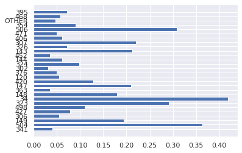
    


### b. Plotting All No Bail Files


```python
nbail_ = np.sum(df_nobail.iloc[:,0:-1] , axis = 0)

nbail_ = nbail_[nbail_>5]

list1 = nbail_[nbail_ != 0].index
# creating the Y Coordinate data as a python list
list2 = nbail_[nbail_ != 0]/170
# plotting the bar graph
plt.barh(list1, list2)
# displaying the bar graph
plt.show()
```


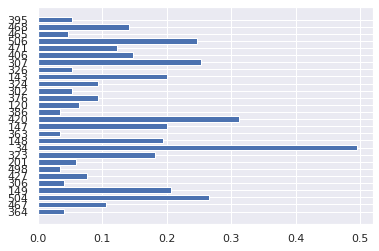
    


```python
X_train.iloc[X_train.index<170].shape
```


    (140, 146)


# E. **Classifiers for Unbalanced Data**

### a. Bernoulli Naive Bayes


```python
from sklearn.model_selection import train_test_split
X_train, X_test, y_train, y_test = train_test_split(X, y, test_size = 0.20, random_state = 0)
```

#### i. Fitting the Bernoulli Naive Bayes


```python
#Training the Naive Bayes model on the training set

from sklearn.naive_bayes import BernoulliNB
classifier = BernoulliNB()
classifier.fit(X_train, y_train)

#Let’s predict the test results
y_pred  =  classifier.predict(X_test)
```

#### ii. Result of Bernoulli Naive Bayes


```python
from sklearn.metrics import confusion_matrix,f1_score

# Confusion Matrix
cm1 = confusion_matrix(y_test,y_pred)
print('Confusion Matrix : \n', cm1)

# Getting sum of all cases (test)
total1=sum(sum(cm1))

# From confusion matrix calculate different confusin matrix metrics

accuracy1=(cm1[0,0]+cm1[1,1])/total1
print ('Accuracy : ', accuracy1)

sensitivity1 = cm1[1,1]/(cm1[1,0]+cm1[1,1])
print('Sensitivity : ', sensitivity1 )

specificity1 = cm1[0,0]/(cm1[0,0]+cm1[0,1])
print('Specificity : ', specificity1)

FScore= f1_score(y_test, y_pred)
print('F-Score : ', FScore)
```

    Confusion Matrix : 
     [[13 17]
     [10 63]]
    Accuracy :  0.7378640776699029
    Sensitivity :  0.863013698630137
    Specificity :  0.43333333333333335
    F-Score :  0.8235294117647058


```python
# conf_matrix graph
fig, ax = plt.subplots(figsize=(5, 5))
ax.matshow(cm1, cmap=plt.cm.Blues, alpha=0.7)
for i in range(cm1.shape[0]):
    for j in range(cm1.shape[1]):
        ax.text(x=j, y=i,s=cm1[i, j], va='center', ha='center', size='xx-large')

plt.xlabel('Predictions', fontsize=18)
plt.ylabel('Actuals', fontsize=18)
plt.title('Confusion Matrix', fontsize=18)
plt.show()

```


    
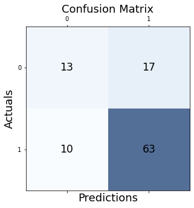
    


#### iii. Plot for Training Bail Files in Frequency Proportion


```python
tb = X_train[X_train.index>74]
tb = np.sum(tb, axis = 0)
tb = tb[tb>10] ## Frequency coming greater than 10
list1 = tb[tb != 0].index
# creating the Y Coordinate data as a python list
list2 = tb[tb != 0]
# plotting the bar graph
plt.barh(list1, list2/271)
# displaying the bar graph
plt.show()
```


    
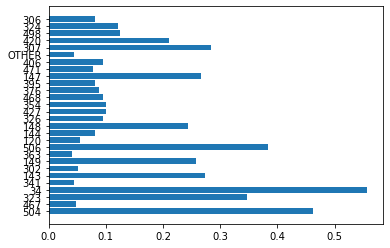
    


#### iii. Plot for Training No Bail Files in Frequency Proportion


```python
tnb = X_train[X_train.index<=74]
tnb = np.sum(tnb, axis = 0)
tnb = tnb[tnb>3]
list1 = tnb[tnb != 0].index
# creating the Y Coordinate data as a python list
list2 = tnb[tnb != 0]
# plotting the bar graph
plt.barh(list1, list2/140)
# displaying the bar graph
plt.show()
```


    
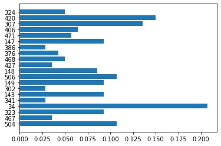
    


### b. k-Nearest Neighbors Classifier


```python
# Importing Jaccard Distance for our Bernoulli Data
from scipy.spatial.distance import jaccard
# Importing k-NN Classifier from Scikit Learn
from sklearn.neighbors import KNeighborsClassifier
# Splitting the Unbalanced Data into 80:20 proportion
X_train, X_test, y_train, y_test = train_test_split(X, y, test_size = 0.20, random_state = 0)
```

#### i. Selecting suitable number of k


```python
error_rate = []
for i in range(1,40):
 knn = KNeighborsClassifier(n_neighbors=i,metric = "jaccard")
 knn.fit(X_train,y_train)
 pred_i = knn.predict(X_test)
 error_rate.append(np.mean(pred_i != y_test))

plt.figure(figsize=(10,6))
plt.plot(range(1,40),error_rate,color='blue', linestyle='dashed',marker='o',markerfacecolor='white', markersize=10)
plt.title('Error Rate vs. K Value')
plt.xlabel('K')
plt.ylabel('Error Rate')
req_k_value = error_rate.index(min(error_rate))+1
print("Minimum error:-",min(error_rate),"at K =",req_k_value)
```

    /usr/local/lib/python3.7/dist-packages/sklearn/metrics/pairwise.py:1875: DataConversionWarning: Data was converted to boolean for metric jaccard
      warnings.warn(msg, DataConversionWarning)
    /usr/local/lib/python3.7/dist-packages/sklearn/metrics/pairwise.py:1875: DataConversionWarning: Data was converted to boolean for metric jaccard
      warnings.warn(msg, DataConversionWarning)
    /usr/local/lib/python3.7/dist-packages/sklearn/metrics/pairwise.py:1875: DataConversionWarning: Data was converted to boolean for metric jaccard
      warnings.warn(msg, DataConversionWarning)
    /usr/local/lib/python3.7/dist-packages/sklearn/metrics/pairwise.py:1875: DataConversionWarning: Data was converted to boolean for metric jaccard
      warnings.warn(msg, DataConversionWarning)
    /usr/local/lib/python3.7/dist-packages/sklearn/metrics/pairwise.py:1875: DataConversionWarning: Data was converted to boolean for metric jaccard
      warnings.warn(msg, DataConversionWarning)
    /usr/local/lib/python3.7/dist-packages/sklearn/metrics/pairwise.py:1875: DataConversionWarning: Data was converted to boolean for metric jaccard
      warnings.warn(msg, DataConversionWarning)
    /usr/local/lib/python3.7/dist-packages/sklearn/metrics/pairwise.py:1875: DataConversionWarning: Data was converted to boolean for metric jaccard
      warnings.warn(msg, DataConversionWarning)
    /usr/local/lib/python3.7/dist-packages/sklearn/metrics/pairwise.py:1875: DataConversionWarning: Data was converted to boolean for metric jaccard
      warnings.warn(msg, DataConversionWarning)
    /usr/local/lib/python3.7/dist-packages/sklearn/metrics/pairwise.py:1875: DataConversionWarning: Data was converted to boolean for metric jaccard
      warnings.warn(msg, DataConversionWarning)
    /usr/local/lib/python3.7/dist-packages/sklearn/metrics/pairwise.py:1875: DataConversionWarning: Data was converted to boolean for metric jaccard
      warnings.warn(msg, DataConversionWarning)
    /usr/local/lib/python3.7/dist-packages/sklearn/metrics/pairwise.py:1875: DataConversionWarning: Data was converted to boolean for metric jaccard
      warnings.warn(msg, DataConversionWarning)
    /usr/local/lib/python3.7/dist-packages/sklearn/metrics/pairwise.py:1875: DataConversionWarning: Data was converted to boolean for metric jaccard
      warnings.warn(msg, DataConversionWarning)
    /usr/local/lib/python3.7/dist-packages/sklearn/metrics/pairwise.py:1875: DataConversionWarning: Data was converted to boolean for metric jaccard
      warnings.warn(msg, DataConversionWarning)
    /usr/local/lib/python3.7/dist-packages/sklearn/metrics/pairwise.py:1875: DataConversionWarning: Data was converted to boolean for metric jaccard
      warnings.warn(msg, DataConversionWarning)
    /usr/local/lib/python3.7/dist-packages/sklearn/metrics/pairwise.py:1875: DataConversionWarning: Data was converted to boolean for metric jaccard
      warnings.warn(msg, DataConversionWarning)
    /usr/local/lib/python3.7/dist-packages/sklearn/metrics/pairwise.py:1875: DataConversionWarning: Data was converted to boolean for metric jaccard
      warnings.warn(msg, DataConversionWarning)
    /usr/local/lib/python3.7/dist-packages/sklearn/metrics/pairwise.py:1875: DataConversionWarning: Data was converted to boolean for metric jaccard
      warnings.warn(msg, DataConversionWarning)
    /usr/local/lib/python3.7/dist-packages/sklearn/metrics/pairwise.py:1875: DataConversionWarning: Data was converted to boolean for metric jaccard
      warnings.warn(msg, DataConversionWarning)
    /usr/local/lib/python3.7/dist-packages/sklearn/metrics/pairwise.py:1875: DataConversionWarning: Data was converted to boolean for metric jaccard
      warnings.warn(msg, DataConversionWarning)
    /usr/local/lib/python3.7/dist-packages/sklearn/metrics/pairwise.py:1875: DataConversionWarning: Data was converted to boolean for metric jaccard
      warnings.warn(msg, DataConversionWarning)
    /usr/local/lib/python3.7/dist-packages/sklearn/metrics/pairwise.py:1875: DataConversionWarning: Data was converted to boolean for metric jaccard
      warnings.warn(msg, DataConversionWarning)
    /usr/local/lib/python3.7/dist-packages/sklearn/metrics/pairwise.py:1875: DataConversionWarning: Data was converted to boolean for metric jaccard
      warnings.warn(msg, DataConversionWarning)
    /usr/local/lib/python3.7/dist-packages/sklearn/metrics/pairwise.py:1875: DataConversionWarning: Data was converted to boolean for metric jaccard
      warnings.warn(msg, DataConversionWarning)
    /usr/local/lib/python3.7/dist-packages/sklearn/metrics/pairwise.py:1875: DataConversionWarning: Data was converted to boolean for metric jaccard
      warnings.warn(msg, DataConversionWarning)
    /usr/local/lib/python3.7/dist-packages/sklearn/metrics/pairwise.py:1875: DataConversionWarning: Data was converted to boolean for metric jaccard
      warnings.warn(msg, DataConversionWarning)
    /usr/local/lib/python3.7/dist-packages/sklearn/metrics/pairwise.py:1875: DataConversionWarning: Data was converted to boolean for metric jaccard
      warnings.warn(msg, DataConversionWarning)
    /usr/local/lib/python3.7/dist-packages/sklearn/metrics/pairwise.py:1875: DataConversionWarning: Data was converted to boolean for metric jaccard
      warnings.warn(msg, DataConversionWarning)
    /usr/local/lib/python3.7/dist-packages/sklearn/metrics/pairwise.py:1875: DataConversionWarning: Data was converted to boolean for metric jaccard
      warnings.warn(msg, DataConversionWarning)
    /usr/local/lib/python3.7/dist-packages/sklearn/metrics/pairwise.py:1875: DataConversionWarning: Data was converted to boolean for metric jaccard
      warnings.warn(msg, DataConversionWarning)
    /usr/local/lib/python3.7/dist-packages/sklearn/metrics/pairwise.py:1875: DataConversionWarning: Data was converted to boolean for metric jaccard
      warnings.warn(msg, DataConversionWarning)
    /usr/local/lib/python3.7/dist-packages/sklearn/metrics/pairwise.py:1875: DataConversionWarning: Data was converted to boolean for metric jaccard
      warnings.warn(msg, DataConversionWarning)
    /usr/local/lib/python3.7/dist-packages/sklearn/metrics/pairwise.py:1875: DataConversionWarning: Data was converted to boolean for metric jaccard
      warnings.warn(msg, DataConversionWarning)
    /usr/local/lib/python3.7/dist-packages/sklearn/metrics/pairwise.py:1875: DataConversionWarning: Data was converted to boolean for metric jaccard
      warnings.warn(msg, DataConversionWarning)
    /usr/local/lib/python3.7/dist-packages/sklearn/metrics/pairwise.py:1875: DataConversionWarning: Data was converted to boolean for metric jaccard
      warnings.warn(msg, DataConversionWarning)
    /usr/local/lib/python3.7/dist-packages/sklearn/metrics/pairwise.py:1875: DataConversionWarning: Data was converted to boolean for metric jaccard
      warnings.warn(msg, DataConversionWarning)
    /usr/local/lib/python3.7/dist-packages/sklearn/metrics/pairwise.py:1875: DataConversionWarning: Data was converted to boolean for metric jaccard
      warnings.warn(msg, DataConversionWarning)
    /usr/local/lib/python3.7/dist-packages/sklearn/metrics/pairwise.py:1875: DataConversionWarning: Data was converted to boolean for metric jaccard
      warnings.warn(msg, DataConversionWarning)
    /usr/local/lib/python3.7/dist-packages/sklearn/metrics/pairwise.py:1875: DataConversionWarning: Data was converted to boolean for metric jaccard
      warnings.warn(msg, DataConversionWarning)
    /usr/local/lib/python3.7/dist-packages/sklearn/metrics/pairwise.py:1875: DataConversionWarning: Data was converted to boolean for metric jaccard
      warnings.warn(msg, DataConversionWarning)


    Minimum error:- 0.2912621359223301 at K = 3


    
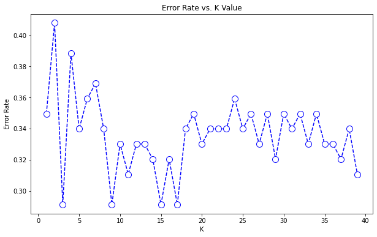
    


#### ii. Fitting k-NN


```python
from sklearn.neighbors import KNeighborsClassifier
classifier = KNeighborsClassifier(n_neighbors = 3, metric = 'jaccard')
classifier.fit(X_train, y_train)
```


    KNeighborsClassifier(metric='jaccard', n_neighbors=3)


```python
y_pred = classifier.predict(X_test)
```

    /usr/local/lib/python3.7/dist-packages/sklearn/metrics/pairwise.py:1875: DataConversionWarning: Data was converted to boolean for metric jaccard
      warnings.warn(msg, DataConversionWarning)


#### iii.  Result of k-NN


```python
# Importing Confusion Matrix from Sklearn
from sklearn.metrics import confusion_matrix,f1_score

cm1 = confusion_matrix(y_test,y_pred)
print('Confusion Matrix : \n', cm1)

total1=sum(sum(cm1))
#####from confusion matrix calculate accuracy
accuracy1=(cm1[0,0]+cm1[1,1])/total1
print ('Accuracy : ', accuracy1)

sensitivity1 = cm1[1,1]/(cm1[1,0]+cm1[1,1])
print('Sensitivity : ', sensitivity1 )

specificity1 = cm1[0,0]/(cm1[0,0]+cm1[0,1])
print('Specificity : ', specificity1)

FScore= f1_score(y_test, y_pred)
print('F-Score : ', FScore)
```

    Confusion Matrix : 
     [[14 16]
     [14 59]]
    Accuracy :  0.7087378640776699
    Sensitivity :  0.8082191780821918
    Specificity :  0.4666666666666667
    F-Score :  0.7972972972972971


```python
# Confusion Matrix
conf_matrix = cm1
fig, ax = plt.subplots(figsize=(5, 5))
ax.matshow(conf_matrix, cmap=plt.cm.Blues, alpha=0.7)
for i in range(conf_matrix.shape[0]):
    for j in range(conf_matrix.shape[1]):
        ax.text(x=j, y=i,s=conf_matrix[i, j], va='center', ha='center', size='xx-large')

plt.xlabel('Predictions', fontsize=18)
plt.ylabel('Actuals', fontsize=18)
plt.title('Confusion Matrix', fontsize=18)
plt.show()

```


    

    


### c. Logistic Regression


```python
X1 = X.copy()
#X1.drop(X.columns[X.sum(axis = 0) < 3] , axis = 1)
```


```python
X_train, X_test, y_train, y_test= train_test_split(X1, y, test_size=0.2, random_state=0)
```


```python
from sklearn.linear_model import LogisticRegression
clf = LogisticRegression()
# training the model
clf.fit(X_train, y_train)
```


    LogisticRegression(C=1.0, class_weight=None, dual=False, fit_intercept=True,
                       intercept_scaling=1, l1_ratio=None, max_iter=100,
                       multi_class='auto', n_jobs=None, penalty='l2',
                       random_state=None, solver='lbfgs', tol=0.0001, verbose=0,
                       warm_start=False)


```python
y_pred = clf.predict(X_test)
```


```python
conf_matrix = confusion_matrix(y_true=y_test, y_pred=y_pred)
fig, ax = plt.subplots(figsize=(5, 5))
ax.matshow(conf_matrix, cmap=plt.cm.Blues, alpha=0.7)
for i in range(conf_matrix.shape[0]):
    for j in range(conf_matrix.shape[1]):
        ax.text(x=j, y=i,s=conf_matrix[i, j], va='center', ha='center', size='xx-large')

plt.xlabel('Predictions', fontsize=18)
plt.ylabel('Actuals', fontsize=18)
plt.title('Confusion Matrix', fontsize=18)
plt.show()

```


    
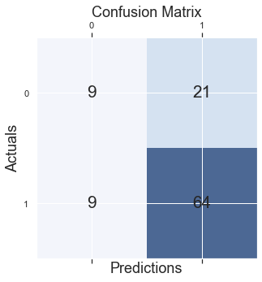
    


```python
accuracy_score(y_test, y_pred)
```


    0.7087378640776699


```python
import pandas as pd
X = pd.read_csv("IPC_Dataset.csv")
```


```python
y = X.iloc[:,-1]
X = X.iloc[:,0:-1]
```

### d. Decision Tree


```python
from sklearn.model_selection import train_test_split
X_train, X_test, y_train, y_test= train_test_split(X, y, test_size=0.2, random_state=0)
```

#### i. Fitting Decision Tree


```python
from sklearn import tree
tree_clf = tree.DecisionTreeClassifier(criterion = "entropy") #, max_depth = 5)
tree_clf = tree_clf.fit(X_train, y_train)
```

#### ii. Plotting the Decision Tree


```python
#plot = tree.plot_tree(clf,figsize=(10,10))
#plot.figure(figsize=(10,10))
from matplotlib import pyplot as plt
fig,axes = plt.subplots(nrows = 1,ncols = 1,figsize = (5,5),dpi = 1200)
tree.plot_tree(tree_clf , filled = True)
[...]
```


    [Ellipsis]


    
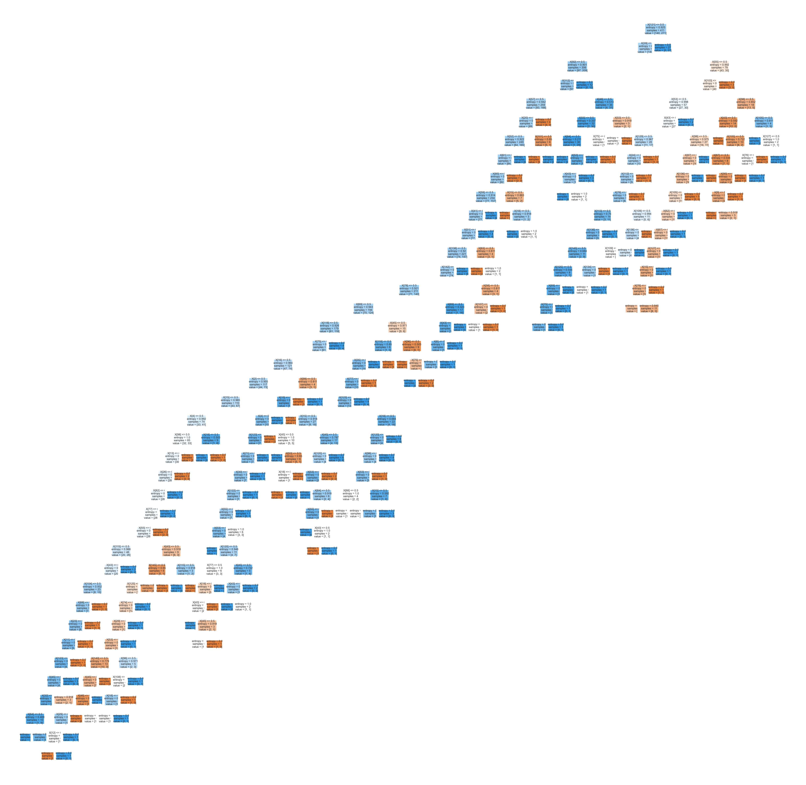
    


```python
y_pred = tree_clf.predict(X_test)
from sklearn.metrics import confusion_matrix,accuracy_score
cm = confusion_matrix(y_test, y_pred)
ac = accuracy_score(y_test,y_pred)
```


```python
cm
```


    array([[16, 14],
           [17, 56]])


```python
ac
```


    0.6990291262135923


#### iii. Cost Complexity Pruning for getting 'best' alpha value


```python
import seaborn as sns
import matplotlib.pyplot as plt
import numpy as np
from sklearn.tree import DecisionTreeClassifier
import sklearn.tree
```


```python
path = tree_clf.cost_complexity_pruning_path(X_train , y_train)
alphas = path["ccp_alphas"]
#alphas
```


```python
accuracy_train,accuracy_test = [],[]
for i in alphas :
    tree_clf = tree.DecisionTreeClassifier(criterion = "entropy",ccp_alpha = i)
    tree_clf.fit(X_train,y_train)
    y_test_pred = tree_clf.predict(X_test)
    y_train_pred = tree_clf.predict(X_train)
    accuracy_train.append(accuracy_score(y_train,y_train_pred))
    accuracy_test.append(accuracy_score(y_test,y_test_pred))

sns.set()
plt.figure(figsize = (14,7))
sns.lineplot(y=accuracy_train , x = alphas , label = "train_accuracy")
sns.lineplot(y=accuracy_test , x = alphas , label = "test_accuracy")
plt.xticks(ticks = np.arange(0,0.04,0.005))
plt.show()


```


    
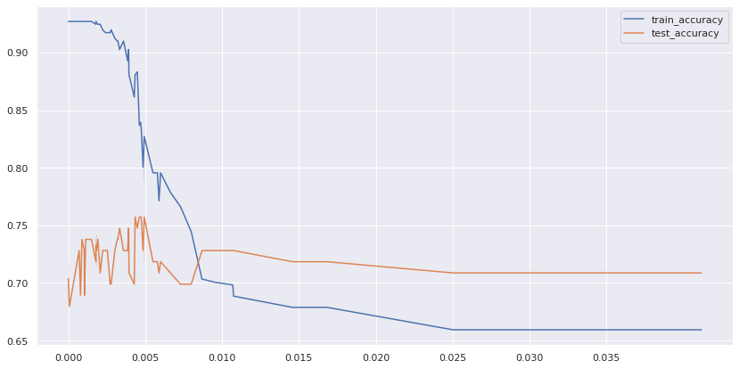
    


#### iv. Fitting Decision Tree with the 'best' alpha value (tuning parameter)  


```python
t = tree.DecisionTreeClassifier(criterion = "entropy",ccp_alpha = 0.008)
```

#### v. Result for the Decision Tree with 'best' alpha value


```python
t.fit(X_train,y_train)
```


    DecisionTreeClassifier(ccp_alpha=0.008, criterion='entropy')


```python
y_pred = t.predict(X_test)
from sklearn.metrics import confusion_matrix,accuracy_score
cm = confusion_matrix(y_test, y_pred)
ac = accuracy_score(y_test,y_pred)
```


```python
cm
```


    array([[13, 17],
           [14, 59]])


```python
ac
```


    0.7087378640776699


```python
conf_matrix = confusion_matrix(y_true=y_test, y_pred=y_pred)
fig, ax = plt.subplots(figsize=(5, 5))
ax.matshow(conf_matrix, cmap=plt.cm.Blues, alpha=0.7)
for i in range(conf_matrix.shape[0]):
    for j in range(conf_matrix.shape[1]):
        ax.text(x=j, y=i,s=conf_matrix[i, j], va='center', ha='center', size='xx-large')

plt.xlabel('Predictions', fontsize=18)
plt.ylabel('Actuals', fontsize=18)
plt.title('Confusion Matrix', fontsize=18)
plt.show()
```


    
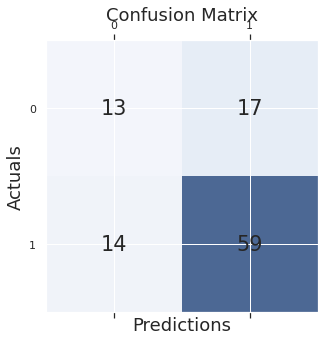
    


### e. Neural Network (NN)

#### i. NN with Scikit Learn


```python
from sklearn.model_selection import train_test_split
X_train, X_test, y_train, y_test = train_test_split(X, y, test_size = 0.20, random_state = 0)
```


    ---------------------------------------------------------------------------

    NameError                                 Traceback (most recent call last)

    <ipython-input-1-fe0ea752b914> in <module>
          1 from sklearn.model_selection import train_test_split
    ----> 2 X_train, X_test, y_train, y_test = train_test_split(X, y, test_size = 0.20, random_state = 0)
    

    NameError: name 'X' is not defined


```python
# Code for ANN

from sklearn.neural_network import MLPClassifier
clf = MLPClassifier(hidden_layer_sizes=(74, 37, 18, 9, 4, 2), activation random_state=0)
# clf = MLPClassifier(hidden_layer_sizes=(64, 34, 4), random_state=0)
clf.fit(X_train, y_train)

#Let’s predict the test results
y_pred  =  clf.predict(X_test)

from sklearn.metrics import confusion_matrix,f1_score

# Confusion Matrix
cm1 = confusion_matrix(y_test,y_pred)
print('Confusion Matrix : \n', cm1)

# Getting sum of all cases (test)
total1=sum(sum(cm1))

# From confusion matrix calculate different confusin matrix metrics

accuracy1=(cm1[0,0]+cm1[1,1])/total1
print ('Accuracy : ', accuracy1)

sensitivity1 = cm1[1,1]/(cm1[1,0]+cm1[1,1])
print('Sensitivity : ', sensitivity1 )

specificity1 = cm1[0,0]/(cm1[0,0]+cm1[0,1])
print('Specificity : ', specificity1)

FScore= f1_score(y_test, y_pred)
print('F-Score : ', FScore)
```


```python
# Confusion Matrix
conf_matrix = cm1
fig, ax = plt.subplots(figsize=(5, 5))
ax.matshow(conf_matrix, cmap=plt.cm.Blues, alpha=0.7)
for i in range(conf_matrix.shape[0]):
    for j in range(conf_matrix.shape[1]):
        ax.text(x=j, y=i,s=conf_matrix[i, j], va='center', ha='center', size='xx-large')

plt.xlabel('Predictions', fontsize=18)
plt.ylabel('Actuals', fontsize=18)
plt.title('Confusion Matrix', fontsize=18)
plt.show()
```

#### ii. [NN with Keras to optimize the hidden layer](https://datagraphi.com/blog/post/2019/12/17/how-to-find-the-optimum-number-of-hidden-layers-and-nodes-in-a-neural-network-model)

###### 1. Importing the Libraries


```python
import pandas as pd
import math

from tensorflow.keras.models import Sequential
from tensorflow.keras.layers import Dense

from tensorflow.keras.wrappers.scikit_learn import KerasClassifier

from sklearn.preprocessing import MinMaxScaler
from sklearn.model_selection import train_test_split

from sklearn.model_selection import GridSearchCV, RandomizedSearchCV
```

###### 2. Optimization to get best hyperparameters for NN


```python
# X= X.to_numpy()
# y = y.to_numpy()

# Function to linearly decrease or increase the number of nodes for the layers between the first layer and last layer

def FindLayerNodesLinear(n_layers, first_layer_nodes, last_layer_nodes):
    layers = []

    nodes_increment = (last_layer_nodes - first_layer_nodes)/ (n_layers-1)
    nodes = first_layer_nodes
    for i in range(1, n_layers+1):
        layers.append(math.ceil(nodes))
        nodes = nodes + nodes_increment

    return layers

# Function to vary the parameters of a tensor flow model by creating a new model based on given parameters

def createmodel(n_layers, first_layer_nodes, last_layer_nodes, activation_func, loss_func):
    model = Sequential()
    n_nodes = FindLayerNodesLinear(n_layers, first_layer_nodes, last_layer_nodes)
    for i in range(1, n_layers):
        if i==1:
            model.add(Dense(first_layer_nodes, input_dim=X_train.shape[1], activation=activation_func))
        else:
            model.add(Dense(n_nodes[i-1], activation=activation_func))

    #Finally, the output layer should have a single node in binary classification
    model.add(Dense(1, activation=activation_func))
    model.compile(optimizer='adam', loss=loss_func, metrics = ["accuracy"]) #note: metrics could also be 'mse'

    return model

##Wrap model into scikit-learn
model =  KerasClassifier(build_fn=createmodel, verbose = False)

# Define the grid for searching the optimal parameters within the grid

activation_funcs = ['sigmoid', 'relu', 'tanh']
loss_funcs = ['binary_crossentropy','hinge']
param_grid = dict(n_layers=[2,3], first_layer_nodes = [64,32,16], last_layer_nodes = [4],  activation_func = activation_funcs, loss_func = loss_funcs, batch_size = [100], epochs = [20,60])
grid = GridSearchCV(estimator = model, param_grid = param_grid)

grid.fit(X,y)

print(grid.best_score_)
print(grid.best_params_)

pd.DataFrame(grid.cv_results_)[['mean_test_score', 'std_test_score', 'params']].to_csv('GridOptimization.csv')
```

    /usr/local/lib/python3.7/dist-packages/ipykernel_launcher.py:32: DeprecationWarning: KerasClassifier is deprecated, use Sci-Keras (https://github.com/adriangb/scikeras) instead. See https://www.adriangb.com/scikeras/stable/migration.html for help migrating.


    WARNING:tensorflow:5 out of the last 9 calls to <function Model.make_test_function.<locals>.test_function at 0x7f88cdf89a70> triggered tf.function retracing. Tracing is expensive and the excessive number of tracings could be due to (1) creating @tf.function repeatedly in a loop, (2) passing tensors with different shapes, (3) passing Python objects instead of tensors. For (1), please define your @tf.function outside of the loop. For (2), @tf.function has experimental_relax_shapes=True option that relaxes argument shapes that can avoid unnecessary retracing. For (3), please refer to https://www.tensorflow.org/guide/function#controlling_retracing and https://www.tensorflow.org/api_docs/python/tf/function for  more details.
    WARNING:tensorflow:6 out of the last 11 calls to <function Model.make_test_function.<locals>.test_function at 0x7f88cdd02b00> triggered tf.function retracing. Tracing is expensive and the excessive number of tracings could be due to (1) creating @tf.function repeatedly in a loop, (2) passing tensors with different shapes, (3) passing Python objects instead of tensors. For (1), please define your @tf.function outside of the loop. For (2), @tf.function has experimental_relax_shapes=True option that relaxes argument shapes that can avoid unnecessary retracing. For (3), please refer to https://www.tensorflow.org/guide/function#controlling_retracing and https://www.tensorflow.org/api_docs/python/tf/function for  more details.
    0.669902914762497
    {'activation_func': 'sigmoid', 'batch_size': 100, 'epochs': 20, 'first_layer_nodes': 64, 'last_layer_nodes': 4, 'loss_func': 'binary_crossentropy', 'n_layers': 3}


```python
# Getting the optimized Hidden layer
FindLayerNodesLinear(3, 64, 4)
```


    [64, 34, 4]


###### 3. [Fitting the Model](https://www.section.io/engineering-education/build-ann-with-keras/#:~:text=%23%20Initializing%20the%20ANN%20ann%20%3D%20tf.keras.models.Sequential%20%28%29,Add%20the%20output%20layer%20ann.add%20%28tf.keras.layers.Dense%20%28units%3D1%2C%20activation%3D%27sigmoid%27%29%29)
The Values are changing with running everytime we have to set a seed.

###### I. With Keras suggested NN architecture


```python
## building Model Optimized Hidden layers

# split the dataset into train and test set
from sklearn.model_selection import train_test_split
X_train, X_test, y_train, y_test = train_test_split(X, y, test_size = 0.2, random_state = 0)

## Build the Artificial Neural Network
import tensorflow as tf
# Initializing the ANN
ann = tf.keras.models.Sequential()
# Add the input layer and first hidden layer
ann.add(tf.keras.layers.Dense(units= 64, activation='sigmoid', input_dim = X_train.shape[1]))
# Add the second hidden layer
ann.add(tf.keras.layers.Dense(units=34, activation='sigmoid'))
# Add the third layer
ann.add(tf.keras.layers.Dense(units=4, activation='sigmoid'))
# Add the output layer
ann.add(tf.keras.layers.Dense(units=1, activation='sigmoid'))

## visualize the Artificial Neural Network
from tensorflow.keras.utils import plot_model
plot_model(ann,
           to_file="model.png",
           show_shapes=True,
           show_layer_names=True,
          )

## Training the ANN
ann.compile(optimizer = 'adam', loss = 'binary_crossentropy', metrics = ['accuracy'])
ann.fit(X_train, y_train, batch_size = 20, epochs = 100)

y_pred = ann.predict(X_test)
y_pred = (y_pred > 0.5)

from sklearn.metrics import confusion_matrix, accuracy_score
print(confusion_matrix(y_test, y_pred))
print(accuracy_score(y_test, y_pred))

```

    Epoch 1/100
    21/21 [==============================] - 1s 2ms/step - loss: 0.6463 - accuracy: 0.6594
    Epoch 2/100
    21/21 [==============================] - 0s 2ms/step - loss: 0.6405 - accuracy: 0.6594
    Epoch 3/100
    21/21 [==============================] - 0s 2ms/step - loss: 0.6405 - accuracy: 0.6594
    Epoch 4/100
    21/21 [==============================] - 0s 2ms/step - loss: 0.6395 - accuracy: 0.6594
    Epoch 5/100
    21/21 [==============================] - 0s 2ms/step - loss: 0.6387 - accuracy: 0.6594
    Epoch 6/100
    21/21 [==============================] - 0s 2ms/step - loss: 0.6398 - accuracy: 0.6594
    Epoch 7/100
    21/21 [==============================] - 0s 2ms/step - loss: 0.6377 - accuracy: 0.6594
    Epoch 8/100
    21/21 [==============================] - 0s 2ms/step - loss: 0.6348 - accuracy: 0.6594
    Epoch 9/100
    21/21 [==============================] - 0s 2ms/step - loss: 0.6328 - accuracy: 0.6594
    Epoch 10/100
    21/21 [==============================] - 0s 2ms/step - loss: 0.6314 - accuracy: 0.6594
    Epoch 11/100
    21/21 [==============================] - 0s 2ms/step - loss: 0.6291 - accuracy: 0.6594
    Epoch 12/100
    21/21 [==============================] - 0s 2ms/step - loss: 0.6249 - accuracy: 0.6594
    Epoch 13/100
    21/21 [==============================] - 0s 2ms/step - loss: 0.6218 - accuracy: 0.6594
    Epoch 14/100
    21/21 [==============================] - 0s 2ms/step - loss: 0.6174 - accuracy: 0.6594
    Epoch 15/100
    21/21 [==============================] - 0s 2ms/step - loss: 0.6133 - accuracy: 0.6594
    Epoch 16/100
    21/21 [==============================] - 0s 2ms/step - loss: 0.6079 - accuracy: 0.6594
    Epoch 17/100
    21/21 [==============================] - 0s 2ms/step - loss: 0.6024 - accuracy: 0.6594
    Epoch 18/100
    21/21 [==============================] - 0s 2ms/step - loss: 0.5956 - accuracy: 0.6594
    Epoch 19/100
    21/21 [==============================] - 0s 2ms/step - loss: 0.5913 - accuracy: 0.6594
    Epoch 20/100
    21/21 [==============================] - 0s 2ms/step - loss: 0.5857 - accuracy: 0.6594
    Epoch 21/100
    21/21 [==============================] - 0s 2ms/step - loss: 0.5757 - accuracy: 0.6594
    Epoch 22/100
    21/21 [==============================] - 0s 2ms/step - loss: 0.5691 - accuracy: 0.6594
    Epoch 23/100
    21/21 [==============================] - 0s 3ms/step - loss: 0.5623 - accuracy: 0.6594
    Epoch 24/100
    21/21 [==============================] - 0s 2ms/step - loss: 0.5562 - accuracy: 0.6667
    Epoch 25/100
    21/21 [==============================] - 0s 2ms/step - loss: 0.5500 - accuracy: 0.6740
    Epoch 26/100
    21/21 [==============================] - 0s 2ms/step - loss: 0.5432 - accuracy: 0.6886
    Epoch 27/100
    21/21 [==============================] - 0s 2ms/step - loss: 0.5375 - accuracy: 0.6934
    Epoch 28/100
    21/21 [==============================] - 0s 2ms/step - loss: 0.5314 - accuracy: 0.7032
    Epoch 29/100
    21/21 [==============================] - 0s 2ms/step - loss: 0.5263 - accuracy: 0.7153
    Epoch 30/100
    21/21 [==============================] - 0s 2ms/step - loss: 0.5232 - accuracy: 0.7226
    Epoch 31/100
    21/21 [==============================] - 0s 2ms/step - loss: 0.5194 - accuracy: 0.7275
    Epoch 32/100
    21/21 [==============================] - 0s 2ms/step - loss: 0.5138 - accuracy: 0.7275
    Epoch 33/100
    21/21 [==============================] - 0s 2ms/step - loss: 0.5075 - accuracy: 0.7251
    Epoch 34/100
    21/21 [==============================] - 0s 2ms/step - loss: 0.5035 - accuracy: 0.7324
    Epoch 35/100
    21/21 [==============================] - 0s 2ms/step - loss: 0.4994 - accuracy: 0.7348
    Epoch 36/100
    21/21 [==============================] - 0s 2ms/step - loss: 0.4948 - accuracy: 0.7372
    Epoch 37/100
    21/21 [==============================] - 0s 2ms/step - loss: 0.4911 - accuracy: 0.7397
    Epoch 38/100
    21/21 [==============================] - 0s 2ms/step - loss: 0.4902 - accuracy: 0.7397
    Epoch 39/100
    21/21 [==============================] - 0s 2ms/step - loss: 0.4864 - accuracy: 0.7616
    Epoch 40/100
    21/21 [==============================] - 0s 2ms/step - loss: 0.4809 - accuracy: 0.7372
    Epoch 41/100
    21/21 [==============================] - 0s 2ms/step - loss: 0.4767 - accuracy: 0.7591
    Epoch 42/100
    21/21 [==============================] - 0s 2ms/step - loss: 0.4737 - accuracy: 0.7567
    Epoch 43/100
    21/21 [==============================] - 0s 2ms/step - loss: 0.4717 - accuracy: 0.7518
    Epoch 44/100
    21/21 [==============================] - 0s 2ms/step - loss: 0.4688 - accuracy: 0.7640
    Epoch 45/100
    21/21 [==============================] - 0s 2ms/step - loss: 0.4653 - accuracy: 0.7567
    Epoch 46/100
    21/21 [==============================] - 0s 2ms/step - loss: 0.4663 - accuracy: 0.7640
    Epoch 47/100
    21/21 [==============================] - 0s 2ms/step - loss: 0.4601 - accuracy: 0.7543
    Epoch 48/100
    21/21 [==============================] - 0s 2ms/step - loss: 0.4602 - accuracy: 0.7591
    Epoch 49/100
    21/21 [==============================] - 0s 3ms/step - loss: 0.4584 - accuracy: 0.7616
    Epoch 50/100
    21/21 [==============================] - 0s 2ms/step - loss: 0.4557 - accuracy: 0.7640
    Epoch 51/100
    21/21 [==============================] - 0s 2ms/step - loss: 0.4529 - accuracy: 0.7640
    Epoch 52/100
    21/21 [==============================] - 0s 2ms/step - loss: 0.4519 - accuracy: 0.7664
    Epoch 53/100
    21/21 [==============================] - 0s 2ms/step - loss: 0.4489 - accuracy: 0.7640
    Epoch 54/100
    21/21 [==============================] - 0s 2ms/step - loss: 0.4502 - accuracy: 0.7591
    Epoch 55/100
    21/21 [==============================] - 0s 2ms/step - loss: 0.4473 - accuracy: 0.7640
    Epoch 56/100
    21/21 [==============================] - 0s 2ms/step - loss: 0.4442 - accuracy: 0.7640
    Epoch 57/100
    21/21 [==============================] - 0s 2ms/step - loss: 0.4410 - accuracy: 0.7640
    Epoch 58/100
    21/21 [==============================] - 0s 2ms/step - loss: 0.4431 - accuracy: 0.7689
    Epoch 59/100
    21/21 [==============================] - 0s 2ms/step - loss: 0.4394 - accuracy: 0.7762
    Epoch 60/100
    21/21 [==============================] - 0s 2ms/step - loss: 0.4415 - accuracy: 0.7640
    Epoch 61/100
    21/21 [==============================] - 0s 2ms/step - loss: 0.4438 - accuracy: 0.7640
    Epoch 62/100
    21/21 [==============================] - 0s 2ms/step - loss: 0.4363 - accuracy: 0.7713
    Epoch 63/100
    21/21 [==============================] - 0s 2ms/step - loss: 0.4352 - accuracy: 0.7762
    Epoch 64/100
    21/21 [==============================] - 0s 2ms/step - loss: 0.4351 - accuracy: 0.7689
    Epoch 65/100
    21/21 [==============================] - 0s 2ms/step - loss: 0.4357 - accuracy: 0.7737
    Epoch 66/100
    21/21 [==============================] - 0s 2ms/step - loss: 0.4326 - accuracy: 0.7762
    Epoch 67/100
    21/21 [==============================] - 0s 2ms/step - loss: 0.4313 - accuracy: 0.7713
    Epoch 68/100
    21/21 [==============================] - 0s 2ms/step - loss: 0.4322 - accuracy: 0.7737
    Epoch 69/100
    21/21 [==============================] - 0s 2ms/step - loss: 0.4362 - accuracy: 0.7737
    Epoch 70/100
    21/21 [==============================] - 0s 2ms/step - loss: 0.4306 - accuracy: 0.7810
    Epoch 71/100
    21/21 [==============================] - 0s 2ms/step - loss: 0.4277 - accuracy: 0.7737
    Epoch 72/100
    21/21 [==============================] - 0s 2ms/step - loss: 0.4322 - accuracy: 0.7762
    Epoch 73/100
    21/21 [==============================] - 0s 2ms/step - loss: 0.4289 - accuracy: 0.7689
    Epoch 74/100
    21/21 [==============================] - 0s 2ms/step - loss: 0.4265 - accuracy: 0.7835
    Epoch 75/100
    21/21 [==============================] - 0s 2ms/step - loss: 0.4269 - accuracy: 0.7762
    Epoch 76/100
    21/21 [==============================] - 0s 2ms/step - loss: 0.4254 - accuracy: 0.7810
    Epoch 77/100
    21/21 [==============================] - 0s 2ms/step - loss: 0.4248 - accuracy: 0.7835
    Epoch 78/100
    21/21 [==============================] - 0s 2ms/step - loss: 0.4272 - accuracy: 0.7810
    Epoch 79/100
    21/21 [==============================] - 0s 2ms/step - loss: 0.4257 - accuracy: 0.7591
    Epoch 80/100
    21/21 [==============================] - 0s 2ms/step - loss: 0.4242 - accuracy: 0.7786
    Epoch 81/100
    21/21 [==============================] - 0s 2ms/step - loss: 0.4225 - accuracy: 0.7786
    Epoch 82/100
    21/21 [==============================] - 0s 2ms/step - loss: 0.4240 - accuracy: 0.7737
    Epoch 83/100
    21/21 [==============================] - 0s 2ms/step - loss: 0.4210 - accuracy: 0.7713
    Epoch 84/100
    21/21 [==============================] - 0s 2ms/step - loss: 0.4206 - accuracy: 0.7689
    Epoch 85/100
    21/21 [==============================] - 0s 2ms/step - loss: 0.4218 - accuracy: 0.7835
    Epoch 86/100
    21/21 [==============================] - 0s 2ms/step - loss: 0.4216 - accuracy: 0.7810
    Epoch 87/100
    21/21 [==============================] - 0s 2ms/step - loss: 0.4190 - accuracy: 0.7859
    Epoch 88/100
    21/21 [==============================] - 0s 2ms/step - loss: 0.4194 - accuracy: 0.7713
    Epoch 89/100
    21/21 [==============================] - 0s 2ms/step - loss: 0.4184 - accuracy: 0.7835
    Epoch 90/100
    21/21 [==============================] - 0s 2ms/step - loss: 0.4181 - accuracy: 0.7762
    Epoch 91/100
    21/21 [==============================] - 0s 2ms/step - loss: 0.4170 - accuracy: 0.7762
    Epoch 92/100
    21/21 [==============================] - 0s 2ms/step - loss: 0.4172 - accuracy: 0.7786
    Epoch 93/100
    21/21 [==============================] - 0s 2ms/step - loss: 0.4176 - accuracy: 0.7762
    Epoch 94/100
    21/21 [==============================] - 0s 2ms/step - loss: 0.4177 - accuracy: 0.7737
    Epoch 95/100
    21/21 [==============================] - 0s 2ms/step - loss: 0.4160 - accuracy: 0.7786
    Epoch 96/100
    21/21 [==============================] - 0s 2ms/step - loss: 0.4162 - accuracy: 0.7762
    Epoch 97/100
    21/21 [==============================] - 0s 2ms/step - loss: 0.4148 - accuracy: 0.7883
    Epoch 98/100
    21/21 [==============================] - 0s 2ms/step - loss: 0.4150 - accuracy: 0.7810
    Epoch 99/100
    21/21 [==============================] - 0s 2ms/step - loss: 0.4146 - accuracy: 0.7859
    Epoch 100/100
    21/21 [==============================] - 0s 2ms/step - loss: 0.4164 - accuracy: 0.7835
    [[18 12]
     [29 44]]
    0.6019417475728155


###### II.  With manually gotten optimized architecture


```python
## building Model Mechanically Optimized Hidden layers

# split the dataset into train and test set
from sklearn.model_selection import train_test_split
X_train, X_test, y_train, y_test = train_test_split(X, y, test_size = 0.2, random_state = 0)

## Build the Artificial Neural Network
import tensorflow as tf
# Initializing the ANN
ann = tf.keras.models.Sequential()
# Add the input layer and first hidden layer
ann.add(tf.keras.layers.Dense(units= 74, activation='relu', input_dim = X_train.shape[1]))
# Add the second hidden layer
ann.add(tf.keras.layers.Dense(units=37, activation='sigmoid'))
# Add the third layer
ann.add(tf.keras.layers.Dense(units=18, activation='sigmoid'))
# Add the fourth layer
ann.add(tf.keras.layers.Dense(units=9, activation='sigmoid'))
# Add the fifth layer
ann.add(tf.keras.layers.Dense(units=4, activation='sigmoid'))
# Add the sixth layer
ann.add(tf.keras.layers.Dense(units=2, activation='sigmoid'))
# Add the output layer
ann.add(tf.keras.layers.Dense(units=1, activation='sigmoid'))

## (74, 37, 18, 9, 4, 2)
## visualize the Artificial Neural Network
from tensorflow.keras.utils import plot_model
plot_model(ann,
           to_file="model.png",
           show_shapes=True,
           show_layer_names=True,
          )

## Training the ANN
ann.compile(optimizer = 'adam', loss = 'binary_crossentropy', metrics = ['accuracy'])
ann.fit(X_train, y_train, batch_size = 20, epochs = 100)

y_pred = ann.predict(X_test)
y_pred = (y_pred > 0.5)

from sklearn.metrics import confusion_matrix, accuracy_score
print(confusion_matrix(y_test, y_pred))
print(accuracy_score(y_test, y_pred))


```

    Epoch 1/100
    21/21 [==============================] - 1s 2ms/step - loss: 0.6679 - accuracy: 0.6594
    Epoch 2/100
    21/21 [==============================] - 0s 2ms/step - loss: 0.6601 - accuracy: 0.6594
    Epoch 3/100
    21/21 [==============================] - 0s 2ms/step - loss: 0.6548 - accuracy: 0.6594
    Epoch 4/100
    21/21 [==============================] - 0s 2ms/step - loss: 0.6504 - accuracy: 0.6594
    Epoch 5/100
    21/21 [==============================] - 0s 3ms/step - loss: 0.6478 - accuracy: 0.6594
    Epoch 6/100
    21/21 [==============================] - 0s 2ms/step - loss: 0.6458 - accuracy: 0.6594
    Epoch 7/100
    21/21 [==============================] - 0s 2ms/step - loss: 0.6443 - accuracy: 0.6594
    Epoch 8/100
    21/21 [==============================] - 0s 2ms/step - loss: 0.6433 - accuracy: 0.6594
    Epoch 9/100
    21/21 [==============================] - 0s 2ms/step - loss: 0.6427 - accuracy: 0.6594
    Epoch 10/100
    21/21 [==============================] - 0s 2ms/step - loss: 0.6420 - accuracy: 0.6594
    Epoch 11/100
    21/21 [==============================] - 0s 2ms/step - loss: 0.6414 - accuracy: 0.6594
    Epoch 12/100
    21/21 [==============================] - 0s 2ms/step - loss: 0.6404 - accuracy: 0.6594
    Epoch 13/100
    21/21 [==============================] - 0s 2ms/step - loss: 0.6390 - accuracy: 0.6594
    Epoch 14/100
    21/21 [==============================] - 0s 3ms/step - loss: 0.6371 - accuracy: 0.6594
    Epoch 15/100
    21/21 [==============================] - 0s 2ms/step - loss: 0.6343 - accuracy: 0.6594
    Epoch 16/100
    21/21 [==============================] - 0s 2ms/step - loss: 0.6302 - accuracy: 0.6594
    Epoch 17/100
    21/21 [==============================] - 0s 2ms/step - loss: 0.6248 - accuracy: 0.6594
    Epoch 18/100
    21/21 [==============================] - 0s 2ms/step - loss: 0.6188 - accuracy: 0.6594
    Epoch 19/100
    21/21 [==============================] - 0s 2ms/step - loss: 0.6116 - accuracy: 0.6594
    Epoch 20/100
    21/21 [==============================] - 0s 2ms/step - loss: 0.6044 - accuracy: 0.6594
    Epoch 21/100
    21/21 [==============================] - 0s 2ms/step - loss: 0.5966 - accuracy: 0.6594
    Epoch 22/100
    21/21 [==============================] - 0s 3ms/step - loss: 0.5884 - accuracy: 0.6594
    Epoch 23/100
    21/21 [==============================] - 0s 2ms/step - loss: 0.5805 - accuracy: 0.6594
    Epoch 24/100
    21/21 [==============================] - 0s 2ms/step - loss: 0.5729 - accuracy: 0.6594
    Epoch 25/100
    21/21 [==============================] - 0s 2ms/step - loss: 0.5648 - accuracy: 0.6594
    Epoch 26/100
    21/21 [==============================] - 0s 2ms/step - loss: 0.5576 - accuracy: 0.6594
    Epoch 27/100
    21/21 [==============================] - 0s 2ms/step - loss: 0.5510 - accuracy: 0.6594
    Epoch 28/100
    21/21 [==============================] - 0s 2ms/step - loss: 0.5450 - accuracy: 0.6594
    Epoch 29/100
    21/21 [==============================] - 0s 2ms/step - loss: 0.5386 - accuracy: 0.6594
    Epoch 30/100
    21/21 [==============================] - 0s 2ms/step - loss: 0.5330 - accuracy: 0.6594
    Epoch 31/100
    21/21 [==============================] - 0s 2ms/step - loss: 0.5272 - accuracy: 0.6594
    Epoch 32/100
    21/21 [==============================] - 0s 2ms/step - loss: 0.5221 - accuracy: 0.6594
    Epoch 33/100
    21/21 [==============================] - 0s 2ms/step - loss: 0.5177 - accuracy: 0.6594
    Epoch 34/100
    21/21 [==============================] - 0s 2ms/step - loss: 0.5127 - accuracy: 0.6594
    Epoch 35/100
    21/21 [==============================] - 0s 2ms/step - loss: 0.5096 - accuracy: 0.7786
    Epoch 36/100
    21/21 [==============================] - 0s 2ms/step - loss: 0.5061 - accuracy: 0.8321
    Epoch 37/100
    21/21 [==============================] - 0s 2ms/step - loss: 0.5011 - accuracy: 0.8321
    Epoch 38/100
    21/21 [==============================] - 0s 2ms/step - loss: 0.4968 - accuracy: 0.8345
    Epoch 39/100
    21/21 [==============================] - 0s 2ms/step - loss: 0.4924 - accuracy: 0.8418
    Epoch 40/100
    21/21 [==============================] - 0s 3ms/step - loss: 0.4889 - accuracy: 0.8418
    Epoch 41/100
    21/21 [==============================] - 0s 2ms/step - loss: 0.4856 - accuracy: 0.8394
    Epoch 42/100
    21/21 [==============================] - 0s 2ms/step - loss: 0.4824 - accuracy: 0.8418
    Epoch 43/100
    21/21 [==============================] - 0s 2ms/step - loss: 0.4793 - accuracy: 0.8418
    Epoch 44/100
    21/21 [==============================] - 0s 2ms/step - loss: 0.4763 - accuracy: 0.8418
    Epoch 45/100
    21/21 [==============================] - 0s 2ms/step - loss: 0.4737 - accuracy: 0.8418
    Epoch 46/100
    21/21 [==============================] - 0s 2ms/step - loss: 0.4710 - accuracy: 0.8418
    Epoch 47/100
    21/21 [==============================] - 0s 2ms/step - loss: 0.4683 - accuracy: 0.8418
    Epoch 48/100
    21/21 [==============================] - 0s 2ms/step - loss: 0.4660 - accuracy: 0.8418
    Epoch 49/100
    21/21 [==============================] - 0s 2ms/step - loss: 0.4636 - accuracy: 0.8418
    Epoch 50/100
    21/21 [==============================] - 0s 2ms/step - loss: 0.4614 - accuracy: 0.8418
    Epoch 51/100
    21/21 [==============================] - 0s 2ms/step - loss: 0.4593 - accuracy: 0.8418
    Epoch 52/100
    21/21 [==============================] - 0s 2ms/step - loss: 0.4571 - accuracy: 0.8418
    Epoch 53/100
    21/21 [==============================] - 0s 2ms/step - loss: 0.4551 - accuracy: 0.8418
    Epoch 54/100
    21/21 [==============================] - 0s 2ms/step - loss: 0.4506 - accuracy: 0.8443
    Epoch 55/100
    21/21 [==============================] - 0s 2ms/step - loss: 0.4486 - accuracy: 0.8443
    Epoch 56/100
    21/21 [==============================] - 0s 2ms/step - loss: 0.4467 - accuracy: 0.8443
    Epoch 57/100
    21/21 [==============================] - 0s 2ms/step - loss: 0.4448 - accuracy: 0.8443
    Epoch 58/100
    21/21 [==============================] - 0s 2ms/step - loss: 0.4432 - accuracy: 0.8443
    Epoch 59/100
    21/21 [==============================] - 0s 3ms/step - loss: 0.4415 - accuracy: 0.8443
    Epoch 60/100
    21/21 [==============================] - 0s 2ms/step - loss: 0.4398 - accuracy: 0.8443
    Epoch 61/100
    21/21 [==============================] - 0s 3ms/step - loss: 0.4384 - accuracy: 0.8443
    Epoch 62/100
    21/21 [==============================] - 0s 2ms/step - loss: 0.4369 - accuracy: 0.8443
    Epoch 63/100
    21/21 [==============================] - 0s 2ms/step - loss: 0.4357 - accuracy: 0.8443
    Epoch 64/100
    21/21 [==============================] - 0s 2ms/step - loss: 0.4341 - accuracy: 0.8443
    Epoch 65/100
    21/21 [==============================] - 0s 2ms/step - loss: 0.4328 - accuracy: 0.8443
    Epoch 66/100
    21/21 [==============================] - 0s 2ms/step - loss: 0.4316 - accuracy: 0.8443
    Epoch 67/100
    21/21 [==============================] - 0s 2ms/step - loss: 0.4304 - accuracy: 0.8443
    Epoch 68/100
    21/21 [==============================] - 0s 2ms/step - loss: 0.4293 - accuracy: 0.8443
    Epoch 69/100
    21/21 [==============================] - 0s 2ms/step - loss: 0.4282 - accuracy: 0.8443
    Epoch 70/100
    21/21 [==============================] - 0s 2ms/step - loss: 0.4274 - accuracy: 0.8443
    Epoch 71/100
    21/21 [==============================] - 0s 2ms/step - loss: 0.4262 - accuracy: 0.8443
    Epoch 72/100
    21/21 [==============================] - 0s 2ms/step - loss: 0.4253 - accuracy: 0.8443
    Epoch 73/100
    21/21 [==============================] - 0s 2ms/step - loss: 0.4247 - accuracy: 0.8443
    Epoch 74/100
    21/21 [==============================] - 0s 2ms/step - loss: 0.4245 - accuracy: 0.8443
    Epoch 75/100
    21/21 [==============================] - 0s 2ms/step - loss: 0.4276 - accuracy: 0.8394
    Epoch 76/100
    21/21 [==============================] - 0s 2ms/step - loss: 0.4248 - accuracy: 0.8418
    Epoch 77/100
    21/21 [==============================] - 0s 2ms/step - loss: 0.4238 - accuracy: 0.8418
    Epoch 78/100
    21/21 [==============================] - 0s 2ms/step - loss: 0.4229 - accuracy: 0.8418
    Epoch 79/100
    21/21 [==============================] - 0s 2ms/step - loss: 0.4222 - accuracy: 0.8418
    Epoch 80/100
    21/21 [==============================] - 0s 2ms/step - loss: 0.4216 - accuracy: 0.8418
    Epoch 81/100
    21/21 [==============================] - 0s 3ms/step - loss: 0.4210 - accuracy: 0.8418
    Epoch 82/100
    21/21 [==============================] - 0s 2ms/step - loss: 0.4204 - accuracy: 0.8418
    Epoch 83/100
    21/21 [==============================] - 0s 2ms/step - loss: 0.4200 - accuracy: 0.8418
    Epoch 84/100
    21/21 [==============================] - 0s 2ms/step - loss: 0.4193 - accuracy: 0.8418
    Epoch 85/100
    21/21 [==============================] - 0s 2ms/step - loss: 0.4188 - accuracy: 0.8418
    Epoch 86/100
    21/21 [==============================] - 0s 2ms/step - loss: 0.4182 - accuracy: 0.8418
    Epoch 87/100
    21/21 [==============================] - 0s 2ms/step - loss: 0.4176 - accuracy: 0.8418
    Epoch 88/100
    21/21 [==============================] - 0s 2ms/step - loss: 0.4172 - accuracy: 0.8443
    Epoch 89/100
    21/21 [==============================] - 0s 2ms/step - loss: 0.4217 - accuracy: 0.8394
    Epoch 90/100
    21/21 [==============================] - 0s 2ms/step - loss: 0.4212 - accuracy: 0.8370
    Epoch 91/100
    21/21 [==============================] - 0s 2ms/step - loss: 0.4216 - accuracy: 0.8394
    Epoch 92/100
    21/21 [==============================] - 0s 2ms/step - loss: 0.4179 - accuracy: 0.8394
    Epoch 93/100
    21/21 [==============================] - 0s 2ms/step - loss: 0.4254 - accuracy: 0.8345
    Epoch 94/100
    21/21 [==============================] - 0s 2ms/step - loss: 0.4129 - accuracy: 0.8443
    Epoch 95/100
    21/21 [==============================] - 0s 3ms/step - loss: 0.4150 - accuracy: 0.8418
    Epoch 96/100
    21/21 [==============================] - 0s 2ms/step - loss: 0.4148 - accuracy: 0.8418
    Epoch 97/100
    21/21 [==============================] - 0s 2ms/step - loss: 0.4144 - accuracy: 0.8418
    Epoch 98/100
    21/21 [==============================] - 0s 2ms/step - loss: 0.4140 - accuracy: 0.8418
    Epoch 99/100
    21/21 [==============================] - 0s 2ms/step - loss: 0.4132 - accuracy: 0.8418
    Epoch 100/100
    21/21 [==============================] - 0s 2ms/step - loss: 0.4112 - accuracy: 0.8443
    [[18 12]
     [21 52]]
    0.6796116504854369


###### III. To visualize the NN Architechture


```python
# ! pip install ann_visualizer
```

    Looking in indexes: https://pypi.org/simple, https://us-python.pkg.dev/colab-wheels/public/simple/
    Requirement already satisfied: ann_visualizer in /usr/local/lib/python3.7/dist-packages (2.5)


```python
from ann_visualizer.visualize import ann_viz;
ann_viz(ann, title ="");
```

### Decision Tree for unbalanced data


```python
from sklearn.model_selection import train_test_split
X_train, X_test, y_train, y_test= train_test_split(X_balanced.iloc[:,0:-1], X_balanced.iloc[:,-1], test_size=0.2, random_state=78)

from sklearn import tree
tree_clf = tree.DecisionTreeClassifier(criterion = "entropy" ,ccp_alpha = 0.005)
tree_clf = tree_clf.fit(X_train, y_train)

#plot = tree.plot_tree(clf,figsize=(10,10))
#plot.figure(figsize=(10,10))
#from matplotlib import pyplot as plt
#fig,axes = plt.subplots(nrows = 1,ncols = 1,figsize = (5,5),dpi = 1200)
#tree.plot_tree(tree_clf , filled = True)
#[...]


y_pred = tree_clf.predict(X_test)
from sklearn.metrics import confusion_matrix,accuracy_score
cm = confusion_matrix(y_test, y_pred)
ac = accuracy_score(y_test,y_pred)

cm

ac
```


    0.7463768115942029


```python
cm
```


    array([[14, 16],
           [13, 60]], dtype=int64)


```python
### Preparing Data for the Resampling (concating X_train and y_train before running resampling)

# X_train_bs = pd.concat([X_train, y_train], axis = 1)
# X_train_nb = X_train_bs.loc[X_train_bs.index<170]
# X_train_b = X_train_bs.loc[X_train_bs.index>=170]
# X_train_b = X_train.loc[X_train.index>=170]
# X_test_bs = pd.concat([X_test, y_test], axis = 1)
# X_test_nb = X_test_bs.loc[X_test_bs.index<170]

# X_test_nb
```


```python
#X_train.loc[X_train.index>=170]
```


```python
# Resampling of all the data at the starting

# BootStrap_Sample_ = df.sample(345, replace = True, random_state = 9)

# BootStrap_Sample
# X_balanced = pd.concat([BootStrap_Sample , df_ipc_zo.iloc[170:, :]],axis = 0)

#X_balanced
```

### F. Resampling:

#### a. ***Over Sampling:***


```python
### Preparing Data for the Resampling (concating X_train and y_train before running resampling)

X_train_bs = pd.concat([X_train, y_train], axis = 1)
X_train_nb = X_train_bs.loc[X_train_bs.index<170]
# X_train_b = X_train_bs.loc[X_train_bs.index>=170]
# X_train_nb
```


```python
# Resampling of X_train,

# Resampling for the X_train
X_train_bs_nb = X_train_nb.sample(271, replace = True, random_state = 9)

# Concating the the resampled nb data with b data
a = pd.concat([X_train.loc[X_train.index>=170] , y_train.loc[X_train.index>=170]], axis=1)
X_train_bs_f = pd.concat([X_train_bs_nb, a], axis=0)

# Taking all the columns leaving label column
X_train_bs   = X_train_bs_f.iloc[:, 0:-1]

# Taking only the label column
y_train_bs   = X_train_bs_f.iloc[:,-1]
```

##### i. Classification with Over Sampling

###### 1. k-NN Classifier


```python
error_rate = []
for i in range(1,40):
 knn = KNeighborsClassifier(n_neighbors=i,metric = "jaccard")
 knn.fit(X_train_bs,y_train_bs)
 pred_i = knn.predict(X_test_bs)
 error_rate.append(np.mean(pred_i != y_test_bs))

plt.figure(figsize=(10,6))
plt.plot(range(1,40),error_rate,color='blue', linestyle='dashed',marker='o',markerfacecolor='white', markersize=10)
plt.title('Error Rate vs. K Value')
plt.xlabel('K')
plt.ylabel('Error Rate')
req_k_value = error_rate.index(min(error_rate))+1
print("Minimum error:-",min(error_rate),"at K =",req_k_value)
```

    Minimum error:- 0.3561643835616438 at K = 24


    
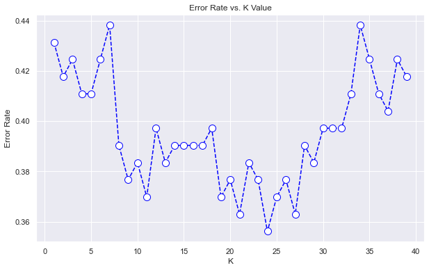
    


```python
# K-NN OVERSAMPLED
from sklearn.neighbors import KNeighborsClassifier
classifier = KNeighborsClassifier(n_neighbors = 24, metric = 'jaccard')
classifier.fit(X_train_bs, y_train_bs)

from sklearn.metrics import confusion_matrix,f1_score

y_pred = classifier.predict(X_test)
cm1 = confusion_matrix(y_test,y_pred)
print('Confusion Matrix : \n', cm1)

total1=sum(sum(cm1))
#####from confusion matrix calculate accuracy
accuracy1=(cm1[0,0]+cm1[1,1])/total1
print ('Accuracy : ', accuracy1)

sensitivity1 = cm1[1,1]/(cm1[1,0]+cm1[1,1])
print('Sensitivity : ', sensitivity1 )

specificity1 = cm1[0,0]/(cm1[0,0]+cm1[0,1])
print('Specificity : ', specificity1)

FScore= f1_score(y_test, y_pred)
print('F-Score : ', FScore)
```

    Confusion Matrix : 
     [[28  2]
     [42 31]]
    Accuracy :  0.5728155339805825
    Sensitivity :  0.4246575342465753
    Specificity :  0.9333333333333333
    F-Score :  0.5849056603773585


```python
#np.sum((X_train_bs.index>=170))
```

###### 2. Bernoulli Naive Bayes


```python
# Naive Bayes with oversampeled
from sklearn.naive_bayes import BernoulliNB
classifier = BernoulliNB()
classifier.fit(X_train_bs, y_train_bs)

#Let’s predict the test results
y_pred  =  classifier.predict(X_test)

from sklearn.metrics import confusion_matrix,f1_score

cm1 = confusion_matrix(y_test,y_pred)
print('Confusion Matrix : \n', cm1)

total1=sum(sum(cm1))
#####from confusion matrix calculate accuracy
accuracy1=(cm1[0,0]+cm1[1,1])/total1
print ('Accuracy : ', accuracy1)

sensitivity1 = cm1[1,1]/(cm1[1,0]+cm1[1,1])
print('Sensitivity : ', sensitivity1 )

specificity1 = cm1[0,0]/(cm1[0,0]+cm1[0,1])
print('Specificity : ', specificity1)

FScore= f1_score(y_test, y_pred)
print('F-Score : ', FScore)
```

    Confusion Matrix : 
     [[16 14]
     [26 47]]
    Accuracy :  0.6116504854368932
    Sensitivity :  0.6438356164383562
    Specificity :  0.5333333333333333
    F-Score :  0.7014925373134328


###### 3. Neural network with Over Sampling:


```python
# # Concating the the resampled nb data with b data
# a = pd.concat([X_train.loc[X_train.index>=170] , y_train.loc[X_train.index>=170]], axis=1) # Bail Files
# X_train_bs_f = pd.concat([X_train_bs_nb, a], axis=0)

# # Taking all the columns leaving label column
# X_train_bs   = X_train_bs_f.iloc[:, 0:-1]
# # Taking only the label column
# y_train_bs   = X_train_bs_f.iloc[:,-1]

# X_overSampled = pd.concat([X_train_bs, X_test])
# y_overSampled = pd.concat([y_train_bs, y_test])
# X_overSampled ## The Size coming according to: Bail_train = 271, No_Bail_train = 271, Bail_test = 73, No_Bail_test = 30, sum= 645.
```


```python
import pandas as pd
import math

from tensorflow.keras.models import Sequential
from tensorflow.keras.layers import Dense

from tensorflow.keras.wrappers.scikit_learn import KerasClassifier

from sklearn.preprocessing import MinMaxScaler
from sklearn.model_selection import train_test_split

from sklearn.model_selection import GridSearchCV, RandomizedSearchCV
```


```python
# X= X.to_numpy()
# y = y.to_numpy()

# Function to linearly decrease or increase the number of nodes for the layers between the first layer and last layer

def FindLayerNodesLinear(n_layers, first_layer_nodes, last_layer_nodes):
    layers = []

    nodes_increment = (last_layer_nodes - first_layer_nodes)/ (n_layers-1)
    nodes = first_layer_nodes
    for i in range(1, n_layers+1):
        layers.append(math.ceil(nodes))
        nodes = nodes + nodes_increment

    return layers

# Function to vary the parameters of a tensor flow model by creating a new model based on given parameters

def createmodel(n_layers, first_layer_nodes, last_layer_nodes, activation_func, loss_func):
    model = Sequential()
    n_nodes = FindLayerNodesLinear(n_layers, first_layer_nodes, last_layer_nodes)
    for i in range(1, n_layers):
        if i==1:
            model.add(Dense(first_layer_nodes, input_dim=X_train.shape[1], activation=activation_func))
        else:
            model.add(Dense(n_nodes[i-1], activation=activation_func))

    #Finally, the output layer should have a single node in binary classification
    model.add(Dense(1, activation=activation_func))
    model.compile(optimizer='adam', loss=loss_func, metrics = ["accuracy"]) #note: metrics could also be 'mse'

    return model

##Wrap model into scikit-learn
model =  KerasClassifier(build_fn=createmodel, verbose = False)

# Define the grid for searching the optimal parameters within the grid

activation_funcs = ['sigmoid', 'relu', 'tanh']
loss_funcs = ['binary_crossentropy','hinge']
param_grid = dict(n_layers=[2,3], first_layer_nodes = [64,32,16], last_layer_nodes = [4],  activation_func = activation_funcs, loss_func = loss_funcs, batch_size = [100], epochs = [20,60])
grid = GridSearchCV(estimator = model, param_grid = param_grid)

grid.fit(X_overSampled,y_overSampled)

print(grid.best_score_)
print(grid.best_params_)

pd.DataFrame(grid.cv_results_)[['mean_test_score', 'std_test_score', 'params']].to_csv('GridOptimizationOverSampled.csv')
```

    /usr/local/lib/python3.7/dist-packages/ipykernel_launcher.py:35: DeprecationWarning: KerasClassifier is deprecated, use Sci-Keras (https://github.com/adriangb/scikeras) instead. See https://www.adriangb.com/scikeras/stable/migration.html for help migrating.


    WARNING:tensorflow:5 out of the last 9 calls to <function Model.make_test_function.<locals>.test_function at 0x7f5d3adb77a0> triggered tf.function retracing. Tracing is expensive and the excessive number of tracings could be due to (1) creating @tf.function repeatedly in a loop, (2) passing tensors with different shapes, (3) passing Python objects instead of tensors. For (1), please define your @tf.function outside of the loop. For (2), @tf.function has experimental_relax_shapes=True option that relaxes argument shapes that can avoid unnecessary retracing. For (3), please refer to https://www.tensorflow.org/guide/function#controlling_retracing and https://www.tensorflow.org/api_docs/python/tf/function for  more details.
    WARNING:tensorflow:6 out of the last 11 calls to <function Model.make_test_function.<locals>.test_function at 0x7f5d3adb30e0> triggered tf.function retracing. Tracing is expensive and the excessive number of tracings could be due to (1) creating @tf.function repeatedly in a loop, (2) passing tensors with different shapes, (3) passing Python objects instead of tensors. For (1), please define your @tf.function outside of the loop. For (2), @tf.function has experimental_relax_shapes=True option that relaxes argument shapes that can avoid unnecessary retracing. For (3), please refer to https://www.tensorflow.org/guide/function#controlling_retracing and https://www.tensorflow.org/api_docs/python/tf/function for  more details.
    0.686821711063385
    {'activation_func': 'relu', 'batch_size': 100, 'epochs': 60, 'first_layer_nodes': 32, 'last_layer_nodes': 4, 'loss_func': 'hinge', 'n_layers': 3}


```python
FindLayerNodesLinear(3, 32, 4)
```


    [32, 18, 4]


```python
## building Model Optimized Hidden layers

# split the dataset into train and test set

## Build the Artificial Neural Network
import tensorflow as tf
# Initializing the ANN
ann = tf.keras.models.Sequential()
# Add the input layer and first hidden layer
ann.add(tf.keras.layers.Dense(units= 32, activation='sigmoid', input_dim = X_train_bs.shape[1]))
# Add the second hidden layer
ann.add(tf.keras.layers.Dense(units= 18, activation='sigmoid'))
# Add the third layer
ann.add(tf.keras.layers.Dense(units= 4, activation='sigmoid'))
# Add the output layer
ann.add(tf.keras.layers.Dense(units= 1, activation='sigmoid'))

## visualize the Artificial Neural Network
from tensorflow.keras.utils import plot_model
plot_model(ann,
           to_file="model.png",
           show_shapes=True,
           show_layer_names=True,
          )

## Training the ANN
ann.compile(optimizer = 'adam', loss = 'binary_crossentropy', metrics = ['accuracy'])
ann.fit(X_train_bs, y_train_bs, batch_size = 20, epochs = 100)

y_pred = ann.predict(X_test)
y_pred = (y_pred > 0.5)

from sklearn.metrics import confusion_matrix, accuracy_score
print(confusion_matrix(y_test, y_pred))
print(accuracy_score(y_test, y_pred))

```

    Epoch 1/100
    28/28 [==============================] - 1s 2ms/step - loss: 0.9216 - accuracy: 0.5000
    Epoch 2/100
    28/28 [==============================] - 0s 2ms/step - loss: 0.8196 - accuracy: 0.5000
    Epoch 3/100
    28/28 [==============================] - 0s 2ms/step - loss: 0.7630 - accuracy: 0.5000
    Epoch 4/100
    28/28 [==============================] - 0s 2ms/step - loss: 0.7331 - accuracy: 0.5000
    Epoch 5/100
    28/28 [==============================] - 0s 2ms/step - loss: 0.7175 - accuracy: 0.5000
    Epoch 6/100
    28/28 [==============================] - 0s 2ms/step - loss: 0.7078 - accuracy: 0.5000
    Epoch 7/100
    28/28 [==============================] - 0s 2ms/step - loss: 0.7029 - accuracy: 0.5000
    Epoch 8/100
    28/28 [==============================] - 0s 2ms/step - loss: 0.6994 - accuracy: 0.5000
    Epoch 9/100
    28/28 [==============================] - 0s 2ms/step - loss: 0.6970 - accuracy: 0.5000
    Epoch 10/100
    28/28 [==============================] - 0s 2ms/step - loss: 0.6950 - accuracy: 0.5000
    Epoch 11/100
    28/28 [==============================] - 0s 2ms/step - loss: 0.6937 - accuracy: 0.5000
    Epoch 12/100
    28/28 [==============================] - 0s 2ms/step - loss: 0.6927 - accuracy: 0.5000
    Epoch 13/100
    28/28 [==============================] - 0s 2ms/step - loss: 0.6919 - accuracy: 0.5000
    Epoch 14/100
    28/28 [==============================] - 0s 3ms/step - loss: 0.6912 - accuracy: 0.5000
    Epoch 15/100
    28/28 [==============================] - 0s 2ms/step - loss: 0.6904 - accuracy: 0.5000
    Epoch 16/100
    28/28 [==============================] - 0s 2ms/step - loss: 0.6899 - accuracy: 0.5000
    Epoch 17/100
    28/28 [==============================] - 0s 2ms/step - loss: 0.6894 - accuracy: 0.5000
    Epoch 18/100
    28/28 [==============================] - 0s 2ms/step - loss: 0.6889 - accuracy: 0.5000
    Epoch 19/100
    28/28 [==============================] - 0s 2ms/step - loss: 0.6881 - accuracy: 0.5000
    Epoch 20/100
    28/28 [==============================] - 0s 2ms/step - loss: 0.6874 - accuracy: 0.5000
    Epoch 21/100
    28/28 [==============================] - 0s 2ms/step - loss: 0.6863 - accuracy: 0.5000
    Epoch 22/100
    28/28 [==============================] - 0s 2ms/step - loss: 0.6850 - accuracy: 0.5000
    Epoch 23/100
    28/28 [==============================] - 0s 2ms/step - loss: 0.6835 - accuracy: 0.5000
    Epoch 24/100
    28/28 [==============================] - 0s 2ms/step - loss: 0.6817 - accuracy: 0.5000
    Epoch 25/100
    28/28 [==============================] - 0s 2ms/step - loss: 0.6795 - accuracy: 0.5000
    Epoch 26/100
    28/28 [==============================] - 0s 2ms/step - loss: 0.6773 - accuracy: 0.5387
    Epoch 27/100
    28/28 [==============================] - 0s 2ms/step - loss: 0.6734 - accuracy: 0.5055
    Epoch 28/100
    28/28 [==============================] - 0s 2ms/step - loss: 0.6689 - accuracy: 0.5129
    Epoch 29/100
    28/28 [==============================] - 0s 2ms/step - loss: 0.6646 - accuracy: 0.5166
    Epoch 30/100
    28/28 [==============================] - 0s 2ms/step - loss: 0.6577 - accuracy: 0.5480
    Epoch 31/100
    28/28 [==============================] - 0s 2ms/step - loss: 0.6498 - accuracy: 0.5756
    Epoch 32/100
    28/28 [==============================] - 0s 2ms/step - loss: 0.6436 - accuracy: 0.5756
    Epoch 33/100
    28/28 [==============================] - 0s 2ms/step - loss: 0.6344 - accuracy: 0.6476
    Epoch 34/100
    28/28 [==============================] - 0s 2ms/step - loss: 0.6259 - accuracy: 0.6734
    Epoch 35/100
    28/28 [==============================] - 0s 2ms/step - loss: 0.6172 - accuracy: 0.6753
    Epoch 36/100
    28/28 [==============================] - 0s 2ms/step - loss: 0.6078 - accuracy: 0.6956
    Epoch 37/100
    28/28 [==============================] - 0s 2ms/step - loss: 0.5990 - accuracy: 0.6974
    Epoch 38/100
    28/28 [==============================] - 0s 2ms/step - loss: 0.5914 - accuracy: 0.6882
    Epoch 39/100
    28/28 [==============================] - 0s 2ms/step - loss: 0.5841 - accuracy: 0.7325
    Epoch 40/100
    28/28 [==============================] - 0s 3ms/step - loss: 0.5764 - accuracy: 0.7343
    Epoch 41/100
    28/28 [==============================] - 0s 2ms/step - loss: 0.5686 - accuracy: 0.7288
    Epoch 42/100
    28/28 [==============================] - 0s 2ms/step - loss: 0.5607 - accuracy: 0.7380
    Epoch 43/100
    28/28 [==============================] - 0s 2ms/step - loss: 0.5552 - accuracy: 0.7454
    Epoch 44/100
    28/28 [==============================] - 0s 2ms/step - loss: 0.5493 - accuracy: 0.7417
    Epoch 45/100
    28/28 [==============================] - 0s 2ms/step - loss: 0.5424 - accuracy: 0.7565
    Epoch 46/100
    28/28 [==============================] - 0s 2ms/step - loss: 0.5373 - accuracy: 0.7565
    Epoch 47/100
    28/28 [==============================] - 0s 2ms/step - loss: 0.5318 - accuracy: 0.7601
    Epoch 48/100
    28/28 [==============================] - 0s 2ms/step - loss: 0.5267 - accuracy: 0.7620
    Epoch 49/100
    28/28 [==============================] - 0s 2ms/step - loss: 0.5229 - accuracy: 0.7472
    Epoch 50/100
    28/28 [==============================] - 0s 2ms/step - loss: 0.5178 - accuracy: 0.7601
    Epoch 51/100
    28/28 [==============================] - 0s 2ms/step - loss: 0.5136 - accuracy: 0.7786
    Epoch 52/100
    28/28 [==============================] - 0s 2ms/step - loss: 0.5096 - accuracy: 0.7878
    Epoch 53/100
    28/28 [==============================] - 0s 2ms/step - loss: 0.5046 - accuracy: 0.7897
    Epoch 54/100
    28/28 [==============================] - 0s 2ms/step - loss: 0.5020 - accuracy: 0.7823
    Epoch 55/100
    28/28 [==============================] - 0s 2ms/step - loss: 0.4984 - accuracy: 0.7823
    Epoch 56/100
    28/28 [==============================] - 0s 2ms/step - loss: 0.4955 - accuracy: 0.7786
    Epoch 57/100
    28/28 [==============================] - 0s 2ms/step - loss: 0.4916 - accuracy: 0.7878
    Epoch 58/100
    28/28 [==============================] - 0s 2ms/step - loss: 0.4886 - accuracy: 0.7860
    Epoch 59/100
    28/28 [==============================] - 0s 2ms/step - loss: 0.4861 - accuracy: 0.7860
    Epoch 60/100
    28/28 [==============================] - 0s 2ms/step - loss: 0.4838 - accuracy: 0.7804
    Epoch 61/100
    28/28 [==============================] - 0s 2ms/step - loss: 0.4803 - accuracy: 0.7878
    Epoch 62/100
    28/28 [==============================] - 0s 2ms/step - loss: 0.4795 - accuracy: 0.7823
    Epoch 63/100
    28/28 [==============================] - 0s 2ms/step - loss: 0.4765 - accuracy: 0.7860
    Epoch 64/100
    28/28 [==============================] - 0s 2ms/step - loss: 0.4738 - accuracy: 0.7878
    Epoch 65/100
    28/28 [==============================] - 0s 2ms/step - loss: 0.4722 - accuracy: 0.7804
    Epoch 66/100
    28/28 [==============================] - 0s 2ms/step - loss: 0.4708 - accuracy: 0.7878
    Epoch 67/100
    28/28 [==============================] - 0s 2ms/step - loss: 0.4681 - accuracy: 0.7860
    Epoch 68/100
    28/28 [==============================] - 0s 2ms/step - loss: 0.4662 - accuracy: 0.7841
    Epoch 69/100
    28/28 [==============================] - 0s 2ms/step - loss: 0.4651 - accuracy: 0.7878
    Epoch 70/100
    28/28 [==============================] - 0s 2ms/step - loss: 0.4632 - accuracy: 0.7841
    Epoch 71/100
    28/28 [==============================] - 0s 2ms/step - loss: 0.4613 - accuracy: 0.7860
    Epoch 72/100
    28/28 [==============================] - 0s 2ms/step - loss: 0.4608 - accuracy: 0.7823
    Epoch 73/100
    28/28 [==============================] - 0s 2ms/step - loss: 0.4587 - accuracy: 0.7934
    Epoch 74/100
    28/28 [==============================] - 0s 2ms/step - loss: 0.4574 - accuracy: 0.7915
    Epoch 75/100
    28/28 [==============================] - 0s 2ms/step - loss: 0.4562 - accuracy: 0.7934
    Epoch 76/100
    28/28 [==============================] - 0s 2ms/step - loss: 0.4550 - accuracy: 0.7915
    Epoch 77/100
    28/28 [==============================] - 0s 2ms/step - loss: 0.4545 - accuracy: 0.7952
    Epoch 78/100
    28/28 [==============================] - 0s 2ms/step - loss: 0.4522 - accuracy: 0.7934
    Epoch 79/100
    28/28 [==============================] - 0s 2ms/step - loss: 0.4513 - accuracy: 0.7989
    Epoch 80/100
    28/28 [==============================] - 0s 2ms/step - loss: 0.4508 - accuracy: 0.7934
    Epoch 81/100
    28/28 [==============================] - 0s 2ms/step - loss: 0.4488 - accuracy: 0.7915
    Epoch 82/100
    28/28 [==============================] - 0s 2ms/step - loss: 0.4482 - accuracy: 0.7934
    Epoch 83/100
    28/28 [==============================] - 0s 2ms/step - loss: 0.4481 - accuracy: 0.7934
    Epoch 84/100
    28/28 [==============================] - 0s 2ms/step - loss: 0.4463 - accuracy: 0.7934
    Epoch 85/100
    28/28 [==============================] - 0s 2ms/step - loss: 0.4456 - accuracy: 0.7952
    Epoch 86/100
    28/28 [==============================] - 0s 2ms/step - loss: 0.4443 - accuracy: 0.7952
    Epoch 87/100
    28/28 [==============================] - 0s 2ms/step - loss: 0.4431 - accuracy: 0.8026
    Epoch 88/100
    28/28 [==============================] - 0s 2ms/step - loss: 0.4430 - accuracy: 0.7970
    Epoch 89/100
    28/28 [==============================] - 0s 2ms/step - loss: 0.4418 - accuracy: 0.8007
    Epoch 90/100
    28/28 [==============================] - 0s 2ms/step - loss: 0.4408 - accuracy: 0.8081
    Epoch 91/100
    28/28 [==============================] - 0s 2ms/step - loss: 0.4400 - accuracy: 0.8100
    Epoch 92/100
    28/28 [==============================] - 0s 2ms/step - loss: 0.4397 - accuracy: 0.8100
    Epoch 93/100
    28/28 [==============================] - 0s 2ms/step - loss: 0.4409 - accuracy: 0.8063
    Epoch 94/100
    28/28 [==============================] - 0s 2ms/step - loss: 0.4379 - accuracy: 0.8063
    Epoch 95/100
    28/28 [==============================] - 0s 2ms/step - loss: 0.4367 - accuracy: 0.8081
    Epoch 96/100
    28/28 [==============================] - 0s 2ms/step - loss: 0.4375 - accuracy: 0.8063
    Epoch 97/100
    28/28 [==============================] - 0s 2ms/step - loss: 0.4353 - accuracy: 0.8063
    Epoch 98/100
    28/28 [==============================] - 0s 2ms/step - loss: 0.4358 - accuracy: 0.8081
    Epoch 99/100
    28/28 [==============================] - 0s 2ms/step - loss: 0.4344 - accuracy: 0.8137
    Epoch 100/100
    28/28 [==============================] - 0s 2ms/step - loss: 0.4333 - accuracy: 0.8081
    [[18 12]
     [34 39]]
    0.5533980582524272


#### b. ***Under Sampling:***


```python
## Bail Files (X & y)
X_b = df.iloc[170:, :]
X_b
## No Bail Files (X & y)
X_nb = df.iloc[:170, :]

## Selection of 170 files out of 344 Bail Files
X_bs_b = X_b.sample(170, replace = True, random_state = 9)

# Joining 170 randomly chosen files Bail file with other 170 No Bails
X_bs_us = pd.concat([X_nb, X_bs_b], axis=0)
#X_bs_us
```

##### i. Classification with Under Sampling

###### 1. k-NN Classifier


```python
from sklearn.model_selection import train_test_split
X_train, X_test, y_train, y_test= train_test_split(X_bs_us.iloc[:,0:-1], X_bs_us.iloc[:,-1], test_size=0.2, random_state=78)

```


```python
error_rate = []
for i in range(1,40):
 knn = KNeighborsClassifier(n_neighbors=i,metric = "jaccard")
 knn.fit(X_train,y_train)
 pred_i = knn.predict(X_test)
 error_rate.append(np.mean(pred_i != y_test))

plt.figure(figsize=(10,6))
plt.plot(range(1,40),error_rate,color='blue', linestyle='dashed',marker='o',markerfacecolor='white', markersize=10)
plt.title('Error Rate vs. K Value')
plt.xlabel('K')
plt.ylabel('Error Rate')
req_k_value = error_rate.index(min(error_rate))+1
print("Minimum error:-",min(error_rate),"at K =",req_k_value)
```

    Minimum error:- 0.2647058823529412 at K = 3


    
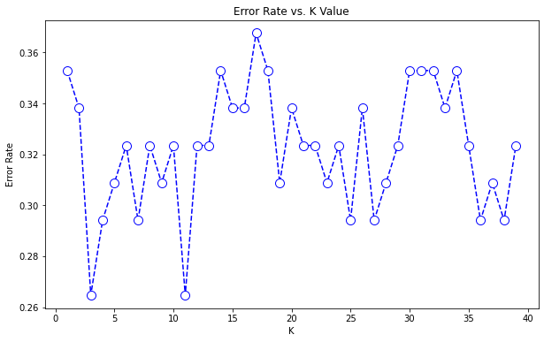
    


```python
from sklearn.neighbors import KNeighborsClassifier
classifier = KNeighborsClassifier(n_neighbors = 3, metric = 'jaccard')
classifier.fit(X_train, y_train)


from sklearn.metrics import confusion_matrix,f1_score

y_pred = classifier.predict(X_test)
cm1 = confusion_matrix(y_test,y_pred)
print('Confusion Matrix : \n', cm1)

total1=sum(sum(cm1))
#####from confusion matrix calculate accuracy
accuracy1=(cm1[0,0]+cm1[1,1])/total1
print ('Accuracy : ', accuracy1)

sensitivity1 = cm1[1,1]/(cm1[1,0]+cm1[1,1])
print('Sensitivity : ', sensitivity1 )

specificity1 = cm1[0,0]/(cm1[0,0]+cm1[0,1])
print('Specificity : ', specificity1)

FScore= f1_score(y_test, y_pred)
print('F-Score : ', FScore)
```

    Confusion Matrix : 
     [[25  4]
     [14 25]]
    Accuracy :  0.7352941176470589
    Sensitivity :  0.6410256410256411
    Specificity :  0.8620689655172413
    F-Score :  0.7352941176470588


###### 2. Bernoulli Naive Bayes


```python
#from sklearn.model_selection import train_test_split
#X_train, X_test, y_train, y_test = train_test_split(X, y, test_size = 0.20, random_state = 0)

#Training the Naive Bayes model on the training set

from sklearn.naive_bayes import BernoulliNB
classifier = BernoulliNB()
classifier.fit(X_train, y_train)

#Let’s predict the test results
y_pred  =  classifier.predict(X_test)

from sklearn.metrics import confusion_matrix,f1_score

# Confusion Matrix
cm1 = confusion_matrix(y_test,y_pred)
print('Confusion Matrix : \n', cm1)

# Getting sum of all cases (test)
total1=sum(sum(cm1))

# From confusion matrix calculate different confusin matrix metrics

accuracy1=(cm1[0,0]+cm1[1,1])/total1
print ('Accuracy : ', accuracy1)

sensitivity1 = cm1[1,1]/(cm1[1,0]+cm1[1,1])
print('Sensitivity : ', sensitivity1 )

specificity1 = cm1[0,0]/(cm1[0,0]+cm1[0,1])
print('Specificity : ', specificity1)

FScore= f1_score(y_test, y_pred)
print('F-Score : ', FScore)
```

    Confusion Matrix : 
     [[19 10]
     [13 26]]
    Accuracy :  0.6617647058823529
    Sensitivity :  0.6666666666666666
    Specificity :  0.6551724137931034
    F-Score :  0.6933333333333334


### Over Sampling and ANN

## Creation of Over Samples


```python
from sklearn.model_selection import train_test_split
X_train, X_test, y_train, y_test = train_test_split(X, y, test_size = 0.2, random_state = 0)
X_train
```


  <div id="df-9a53961a-3493-4c42-8112-7e713a587aca">
    <div class="colab-df-container">
      <div>
<style scoped>
    .dataframe tbody tr th:only-of-type {
        vertical-align: middle;
    }

    .dataframe tbody tr th {
        vertical-align: top;
    }

    .dataframe thead th {
        text-align: right;
    }
</style>
<table border="1" class="dataframe">
  <thead>
    <tr style="text-align: right;">
      <th></th>
      <th>341</th>
      <th>343</th>
      <th>364</th>
      <th>328</th>
      <th>512</th>
      <th>353</th>
      <th>411</th>
      <th>405</th>
      <th>366</th>
      <th>494</th>
      <th>...</th>
      <th>212</th>
      <th>336</th>
      <th>511</th>
      <th>304</th>
      <th>463</th>
      <th>181</th>
      <th>468</th>
      <th>172</th>
      <th>395</th>
      <th>313</th>
    </tr>
  </thead>
  <tbody>
    <tr>
      <th>297</th>
      <td>0</td>
      <td>0</td>
      <td>0</td>
      <td>0</td>
      <td>0</td>
      <td>0</td>
      <td>0</td>
      <td>0</td>
      <td>0</td>
      <td>0</td>
      <td>...</td>
      <td>0</td>
      <td>0</td>
      <td>0</td>
      <td>0</td>
      <td>0</td>
      <td>0</td>
      <td>0</td>
      <td>0</td>
      <td>0</td>
      <td>0</td>
    </tr>
    <tr>
      <th>311</th>
      <td>0</td>
      <td>0</td>
      <td>0</td>
      <td>0</td>
      <td>0</td>
      <td>0</td>
      <td>0</td>
      <td>0</td>
      <td>0</td>
      <td>0</td>
      <td>...</td>
      <td>0</td>
      <td>0</td>
      <td>0</td>
      <td>0</td>
      <td>0</td>
      <td>0</td>
      <td>0</td>
      <td>0</td>
      <td>0</td>
      <td>0</td>
    </tr>
    <tr>
      <th>298</th>
      <td>0</td>
      <td>0</td>
      <td>0</td>
      <td>0</td>
      <td>0</td>
      <td>0</td>
      <td>0</td>
      <td>0</td>
      <td>0</td>
      <td>0</td>
      <td>...</td>
      <td>0</td>
      <td>0</td>
      <td>0</td>
      <td>0</td>
      <td>0</td>
      <td>0</td>
      <td>1</td>
      <td>0</td>
      <td>0</td>
      <td>0</td>
    </tr>
    <tr>
      <th>71</th>
      <td>0</td>
      <td>0</td>
      <td>0</td>
      <td>0</td>
      <td>0</td>
      <td>0</td>
      <td>0</td>
      <td>0</td>
      <td>0</td>
      <td>0</td>
      <td>...</td>
      <td>0</td>
      <td>0</td>
      <td>0</td>
      <td>0</td>
      <td>0</td>
      <td>0</td>
      <td>0</td>
      <td>0</td>
      <td>0</td>
      <td>0</td>
    </tr>
    <tr>
      <th>170</th>
      <td>0</td>
      <td>0</td>
      <td>0</td>
      <td>0</td>
      <td>0</td>
      <td>0</td>
      <td>0</td>
      <td>0</td>
      <td>0</td>
      <td>1</td>
      <td>...</td>
      <td>0</td>
      <td>0</td>
      <td>0</td>
      <td>0</td>
      <td>0</td>
      <td>0</td>
      <td>0</td>
      <td>0</td>
      <td>0</td>
      <td>0</td>
    </tr>
    <tr>
      <th>...</th>
      <td>...</td>
      <td>...</td>
      <td>...</td>
      <td>...</td>
      <td>...</td>
      <td>...</td>
      <td>...</td>
      <td>...</td>
      <td>...</td>
      <td>...</td>
      <td>...</td>
      <td>...</td>
      <td>...</td>
      <td>...</td>
      <td>...</td>
      <td>...</td>
      <td>...</td>
      <td>...</td>
      <td>...</td>
      <td>...</td>
      <td>...</td>
    </tr>
    <tr>
      <th>277</th>
      <td>0</td>
      <td>0</td>
      <td>0</td>
      <td>0</td>
      <td>0</td>
      <td>0</td>
      <td>0</td>
      <td>0</td>
      <td>0</td>
      <td>0</td>
      <td>...</td>
      <td>0</td>
      <td>0</td>
      <td>0</td>
      <td>0</td>
      <td>0</td>
      <td>0</td>
      <td>0</td>
      <td>0</td>
      <td>0</td>
      <td>0</td>
    </tr>
    <tr>
      <th>211</th>
      <td>0</td>
      <td>0</td>
      <td>0</td>
      <td>0</td>
      <td>0</td>
      <td>0</td>
      <td>0</td>
      <td>0</td>
      <td>0</td>
      <td>0</td>
      <td>...</td>
      <td>0</td>
      <td>0</td>
      <td>0</td>
      <td>0</td>
      <td>0</td>
      <td>0</td>
      <td>1</td>
      <td>0</td>
      <td>0</td>
      <td>0</td>
    </tr>
    <tr>
      <th>9</th>
      <td>0</td>
      <td>0</td>
      <td>0</td>
      <td>0</td>
      <td>0</td>
      <td>0</td>
      <td>0</td>
      <td>0</td>
      <td>0</td>
      <td>0</td>
      <td>...</td>
      <td>0</td>
      <td>0</td>
      <td>0</td>
      <td>0</td>
      <td>0</td>
      <td>0</td>
      <td>0</td>
      <td>0</td>
      <td>0</td>
      <td>0</td>
    </tr>
    <tr>
      <th>359</th>
      <td>0</td>
      <td>0</td>
      <td>0</td>
      <td>0</td>
      <td>0</td>
      <td>0</td>
      <td>0</td>
      <td>0</td>
      <td>0</td>
      <td>0</td>
      <td>...</td>
      <td>0</td>
      <td>0</td>
      <td>0</td>
      <td>0</td>
      <td>0</td>
      <td>0</td>
      <td>0</td>
      <td>0</td>
      <td>0</td>
      <td>0</td>
    </tr>
    <tr>
      <th>192</th>
      <td>0</td>
      <td>0</td>
      <td>0</td>
      <td>0</td>
      <td>0</td>
      <td>0</td>
      <td>0</td>
      <td>0</td>
      <td>0</td>
      <td>0</td>
      <td>...</td>
      <td>0</td>
      <td>0</td>
      <td>0</td>
      <td>0</td>
      <td>0</td>
      <td>0</td>
      <td>0</td>
      <td>0</td>
      <td>0</td>
      <td>0</td>
    </tr>
  </tbody>
</table>
<p>411 rows × 146 columns</p>
</div>
      <button class="colab-df-convert" onclick="convertToInteractive('df-9a53961a-3493-4c42-8112-7e713a587aca')"
              title="Convert this dataframe to an interactive table."
              style="display:none;">

  <svg xmlns="http://www.w3.org/2000/svg" height="24px"viewBox="0 0 24 24"
       width="24px">
    <path d="M0 0h24v24H0V0z" fill="none"/>
    <path d="M18.56 5.44l.94 2.06.94-2.06 2.06-.94-2.06-.94-.94-2.06-.94 2.06-2.06.94zm-11 1L8.5 8.5l.94-2.06 2.06-.94-2.06-.94L8.5 2.5l-.94 2.06-2.06.94zm10 10l.94 2.06.94-2.06 2.06-.94-2.06-.94-.94-2.06-.94 2.06-2.06.94z"/><path d="M17.41 7.96l-1.37-1.37c-.4-.4-.92-.59-1.43-.59-.52 0-1.04.2-1.43.59L10.3 9.45l-7.72 7.72c-.78.78-.78 2.05 0 2.83L4 21.41c.39.39.9.59 1.41.59.51 0 1.02-.2 1.41-.59l7.78-7.78 2.81-2.81c.8-.78.8-2.07 0-2.86zM5.41 20L4 18.59l7.72-7.72 1.47 1.35L5.41 20z"/>
  </svg>
      </button>

  <style>
    .colab-df-container {
      display:flex;
      flex-wrap:wrap;
      gap: 12px;
    }

    .colab-df-convert {
      background-color: #E8F0FE;
      border: none;
      border-radius: 50%;
      cursor: pointer;
      display: none;
      fill: #1967D2;
      height: 32px;
      padding: 0 0 0 0;
      width: 32px;
    }

    .colab-df-convert:hover {
      background-color: #E2EBFA;
      box-shadow: 0px 1px 2px rgba(60, 64, 67, 0.3), 0px 1px 3px 1px rgba(60, 64, 67, 0.15);
      fill: #174EA6;
    }

    [theme=dark] .colab-df-convert {
      background-color: #3B4455;
      fill: #D2E3FC;
    }

    [theme=dark] .colab-df-convert:hover {
      background-color: #434B5C;
      box-shadow: 0px 1px 3px 1px rgba(0, 0, 0, 0.15);
      filter: drop-shadow(0px 1px 2px rgba(0, 0, 0, 0.3));
      fill: #FFFFFF;
    }
  </style>

      <script>
        const buttonEl =
          document.querySelector('#df-9a53961a-3493-4c42-8112-7e713a587aca button.colab-df-convert');
        buttonEl.style.display =
          google.colab.kernel.accessAllowed ? 'block' : 'none';

        async function convertToInteractive(key) {
          const element = document.querySelector('#df-9a53961a-3493-4c42-8112-7e713a587aca');
          const dataTable =
            await google.colab.kernel.invokeFunction('convertToInteractive',
                                                     [key], {});
          if (!dataTable) return;

          const docLinkHtml = 'Like what you see? Visit the ' +
            '<a target="_blank" href=https://colab.research.google.com/notebooks/data_table.ipynb>data table notebook</a>'
            + ' to learn more about interactive tables.';
          element.innerHTML = '';
          dataTable['images/output_type'] = 'display_data';
          await google.colab.output.renderOutput(dataTable, element);
          const docLink = document.createElement('div');
          docLink.innerHTML = docLinkHtml;
          element.appendChild(docLink);
        }
      </script>
    </div>
  </div>


```python
# Resampling of X_train,

# Resampling for the X_train
X_train_bs_nb = X_train_nb.sample(271, replace = True, random_state = 9)
```

## Random Forest(Bagging)

# New Section


```python
# evaluate bagging algorithm for classification
from numpy import mean
from numpy import std
from sklearn.model_selection import cross_val_score
from sklearn.model_selection import RepeatedStratifiedKFold
from sklearn.ensemble import BaggingClassifier
```


```python
model = BaggingClassifier()
# evaluate the model
cv = RepeatedStratifiedKFold(n_splits=10, n_repeats=3, random_state=1)
n_scores = cross_val_score(model, X_train, y_train, scoring='accuracy', cv=cv, n_jobs=-1, error_score='raise')
# report performance
print('Accuracy: %.3f (%.3f)' % (mean(n_scores), std(n_scores)))
```

    Accuracy: 0.680 (0.064)


```python
# split the dataset into train and test set
from sklearn.model_selection import train_test_split
X_train, X_test, y_train, y_test = train_test_split(X, y, test_size = 0.2, random_state = 0)

model.fit(X_train, y_train)

#Let’s predict the test results
y_pred  =  model.predict(X_test)

from sklearn.metrics import confusion_matrix,f1_score

# Confusion Matrix
cm1 = confusion_matrix(y_test,y_pred)
print('Confusion Matrix : \n', cm1)

# Getting sum of all cases (test)
total1=sum(sum(cm1))

# From confusion matrix calculate different confusin matrix metrics

accuracy1=(cm1[0,0]+cm1[1,1])/total1
print ('Accuracy : ', accuracy1)

sensitivity1 = cm1[1,1]/(cm1[1,0]+cm1[1,1])
print('Sensitivity : ', sensitivity1 )

specificity1 = cm1[0,0]/(cm1[0,0]+cm1[0,1])
print('Specificity : ', specificity1)

FScore= f1_score(y_test, y_pred)
print('F-Score : ', FScore)
```

    Confusion Matrix : 
     [[17 13]
     [20 53]]
    Accuracy :  0.6796116504854369
    Sensitivity :  0.726027397260274
    Specificity :  0.5666666666666667
    F-Score :  0.7625899280575539


```python

```
